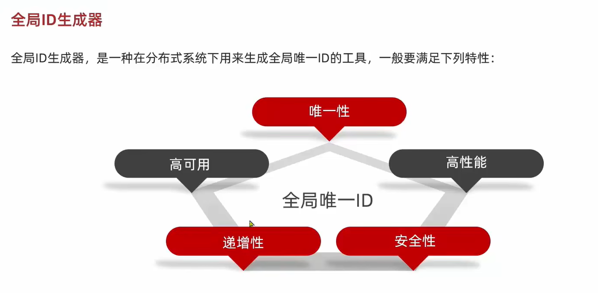
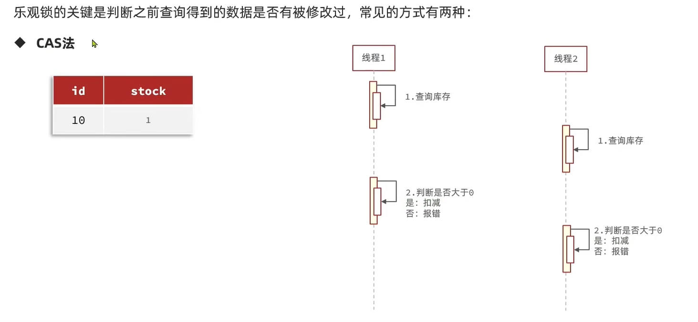
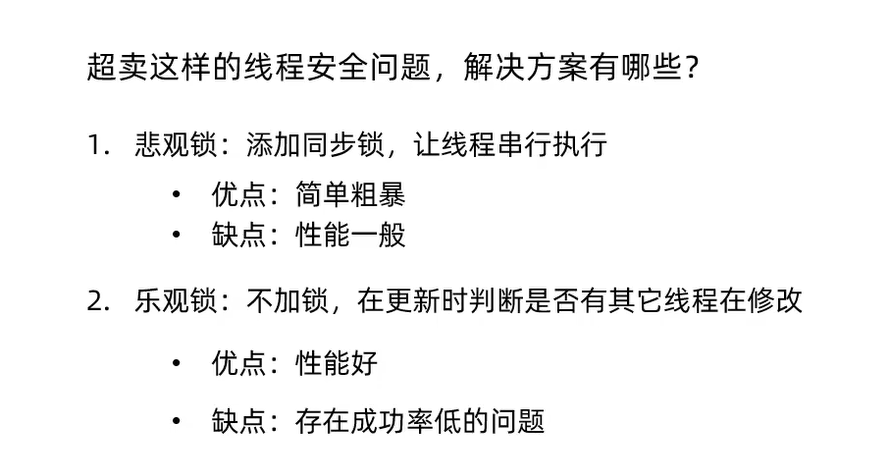
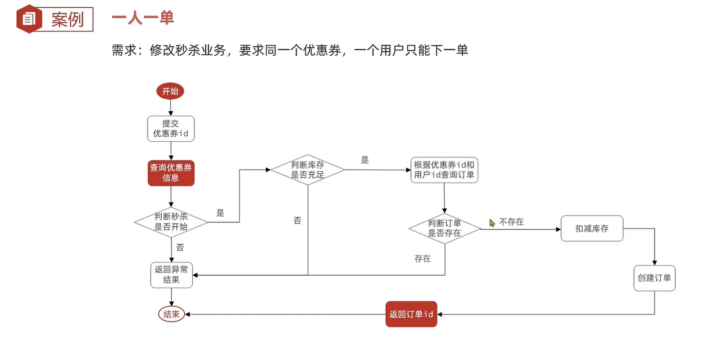

# d第一版 不加锁 库存超卖
```java
// 第一版 不加锁
@Override
@Transactional
public Result seckillVoucher(Long voucherId) {
    // 1 查询优惠券
    SeckillVoucher voucher = seckillVoucherService.getById(voucherId);
    // 2 判断秒杀是否开始
    if(voucher.getBeginTime().isAfter(LocalDateTime.now())){
        return Result.fail("秒杀尚未开始");
    }
    // 3 判断秒杀是否已经结束
    if(voucher.getEndTime().isBefore(LocalDateTime.now())){
        return Result.fail("秒杀已经结束");
    }
    // 4 判断库存是否充足
    if(voucher.getStock() < 1){
        return Result.fail("库存不足");
    }


    boolean success = seckillVoucherService.update().
            setSql("stock = stock - 1")
            .eq("voucher_id", voucherId).update();

    if (!success) {
        return Result.fail("库存不足");
    }
    // 1 创建订单
    VoucherOrder voucherOrder = new VoucherOrder();
    // 2 订单 id
    long orderId = redisIdWorker.nextId("order");
    voucherOrder.setId(orderId);
    // 3 用户 id
    Long userId = UserHolder.getUser().getId();
    voucherOrder.setUserId(userId);
    // 4 代金券 id
    voucherOrder.setVoucherId(voucherId);
    // 5 持久化到数据库
    save(voucherOrder);

    return Result.ok(orderId);
}

```

# 第二版 使用版本号实现乐观锁 解决超卖


进一步优化，使用 stock 作为版本号



优化：
stock 作为版本号 只要判断是否大于0 即可
而不需要判断与之前查到的 stock 是否相等
```java
// 5 扣减库存
boolean success = seckillVoucherService.update()
        .setSql("stock = stock - 1")
        .eq("voucher_id", voucherId)
        .ge("stock", 0)
        .update();
```


缺失：实际上使用了mysql的锁解决并发超卖问题，数据库压力很大

# 第三版 实现一人一单
一个人只能消费同一张优惠券一次
 

下面的代码仍然存在并发冲突问题， 一个人依然可以下多单

```java
// 第三版 在 CAS 乐观锁 解决库存超卖问题 的基础上 实现一人一单
    @Override
    public Result seckillVoucher(Long voucherId) {
        // 1 获取优惠券
        SeckillVoucher voucher = seckillVoucherService.getById(voucherId);
        // 2 判断秒杀是否开始
        if(voucher.getBeginTime().isAfter(LocalDateTime.now())){
            return Result.fail("秒杀尚未开始");
        }
        // 3 判断秒杀是否结束
        if(voucher.getEndTime().isBefore(LocalDateTime.now())){
            return Result.fail("秒杀已经结束");
        }
        // 4 判断库存是否充足
        if (voucher.getStock() < 1) {
            return Result.fail("库存不足");
        }


        Long userId = UserHolder.getUser().getId();

        // 4 先判断一人一单
        Integer count = query()
                .eq("voucher_id", voucherId)
                .eq("user_id", userId)
                .count();
        if(count > 0){
            return Result.fail("不允许重复下单");
        }

        // 5 在执行扣减库存
        boolean success = seckillVoucherService.update()
                .setSql("stock = stock - 1")
                .eq("voucher_id", voucherId)
                .ge("stock", 0)
                .update();
        if(!success){
            return Result.fail("库存不足");
        }

        // 6 创建订单
        VoucherOrder voucherOrder = new VoucherOrder();
        // 6.1 订单 id
        long orderId = redisIdWorker.nextId("order");
        voucherOrder.setId(orderId);
        // 6.3 用户 id

        voucherOrder.setUserId(userId);
        // 6.4 代金券 id
        voucherOrder.setVoucherId(voucherId);
        // 6.5 持久化到数据库
        save(voucherOrder);

        return Result.ok(orderId);
    }
```