# d第一版 不加锁 库存超卖
```java
// 第一版 不加锁
@Override
@Transactional
public Result seckillVoucher(Long voucherId) {
    // 1 查询优惠券
    SeckillVoucher voucher = seckillVoucherService.getById(voucherId);
    // 2 判断秒杀是否开始
    if(voucher.getBeginTime().isAfter(LocalDateTime.now())){
        return Result.fail("秒杀尚未开始");
    }
    // 3 判断秒杀是否已经结束
    if(voucher.getEndTime().isBefore(LocalDateTime.now())){
        return Result.fail("秒杀已经结束");
    }
    // 4 判断库存是否充足
    if(voucher.getStock() < 1){
        return Result.fail("库存不足");
    }


    boolean success = seckillVoucherService.update().
            setSql("stock = stock - 1")
            .eq("voucher_id", voucherId).update();

    if (!success) {
        return Result.fail("库存不足");
    }
    // 1 创建订单
    VoucherOrder voucherOrder = new VoucherOrder();
    // 2 订单 id
    long orderId = redisIdWorker.nextId("order");
    voucherOrder.setId(orderId);
    // 3 用户 id
    Long userId = UserHolder.getUser().getId();
    voucherOrder.setUserId(userId);
    // 4 代金券 id
    voucherOrder.setVoucherId(voucherId);
    // 5 持久化到数据库
    save(voucherOrder);

    return Result.ok(orderId);
}

```

# 第二版 使用版本号实现乐观锁 解决超卖


进一步优化，使用 stock 作为版本号


优化：
stock 作为版本号 只要判断是否大于0 即可
而不需要判断与之前查到的 stock 是否相等
```java
// 5 扣减库存
boolean success = seckillVoucherService.update()
        .setSql("stock = stock - 1")
        .eq("voucher_id", voucherId)
        .ge("stock", 0)
        .update();
```


缺失：实际上使用了mysql的锁解决并发超卖问题，数据库压力很大

# 第三版 实现一人一单
一个人只能消费同一张优惠券一次
 

下面的代码仍然存在并发冲突问题， 一个人依然可以下多单

```java
// 第三版 在 CAS 乐观锁 解决库存超卖问题 的基础上 实现一人一单
    @Override
    public Result seckillVoucher(Long voucherId) {
        // 1 获取优惠券
        SeckillVoucher voucher = seckillVoucherService.getById(voucherId);
        // 2 判断秒杀是否开始
        if(voucher.getBeginTime().isAfter(LocalDateTime.now())){
            return Result.fail("秒杀尚未开始");
        }
        // 3 判断秒杀是否结束
        if(voucher.getEndTime().isBefore(LocalDateTime.now())){
            return Result.fail("秒杀已经结束");
        }
        // 4 判断库存是否充足
        if (voucher.getStock() < 1) {
            return Result.fail("库存不足");
        }


        Long userId = UserHolder.getUser().getId();

        // 4 先判断一人一单
        Integer count = query()
                .eq("voucher_id", voucherId)
                .eq("user_id", userId)
                .count();
        if(count > 0){
            return Result.fail("不允许重复下单");
        }

        // 5 在执行扣减库存
        boolean success = seckillVoucherService.update()
                .setSql("stock = stock - 1")
                .eq("voucher_id", voucherId)
                .ge("stock", 0)
                .update();
        if(!success){
            return Result.fail("库存不足");
        }

        // 6 创建订单
        VoucherOrder voucherOrder = new VoucherOrder();
        // 6.1 订单 id
        long orderId = redisIdWorker.nextId("order");
        voucherOrder.setId(orderId);
        // 6.3 用户 id

        voucherOrder.setUserId(userId);
        // 6.4 代金券 id
        voucherOrder.setVoucherId(voucherId);
        // 6.5 持久化到数据库
        save(voucherOrder);

        return Result.ok(orderId);
    }
```

# 第五版 在分布式场景下  基于 Redis 实现分布式锁
Synchronized 是锁不住 多台服务的多台JVM的
相同的一个用户在多台机器上登录

所以引入 redis 分布式锁


必须保证 设置锁 + 设置锁过期时间 为原子操作

```redis
set lock thread1 nx ex 10
```

```java
// 第五版 在 CAS 乐观锁 解决库存超卖问题 的基础上 利用简单 Redis 分布式锁 解决分布式下 一人一单问题
   @Override
   public Result seckillVoucher(Long voucherId) {
       // 1 获取优惠券
       SeckillVoucher voucher = seckillVoucherService.getById(voucherId);
       // 2 判断秒杀是否开始
       if(voucher.getBeginTime().isAfter(LocalDateTime.now())){
           return Result.fail("秒杀尚未开始");
       }
       // 3 判断秒杀是否结束
       if(voucher.getEndTime().isBefore(LocalDateTime.now())){
           return Result.fail("秒杀已经结束");
       }
       // 4 判断库存是否充足
       if (voucher.getStock() < 1) {
           return Result.fail("库存不足");
       }


       Long userId = UserHolder.getUser().getId();
       SimpleRedisLock lock = new SimpleRedisLock("order:" + userId, stringRedisTemplate);
       boolean isLock = lock.tryLock(1200);
       if (!isLock) {
           return Result.fail("不允许重复下单");
       }
       try {
           // 获取代理对象
           IVoucherOrderService proxy = (IVoucherOrderService) AopContext.currentProxy();
           return proxy.createVoucherOrder(voucherId);
       }finally {
           // 释放锁
           lock.unlock();
       }

   }
```

# 第六版 解决业务超时 redis分布式锁提前释放
导致该业务未执行完成 锁提前释放 另外的业务拿到锁
而等到当前业务执行完成 后 ，释放了正在使用该所的其他业务

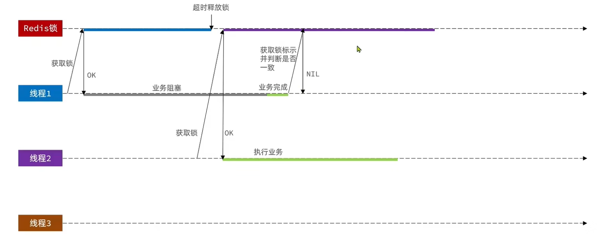

解决方法：在释放锁的时候判断一下锁的标识与自己是否一致
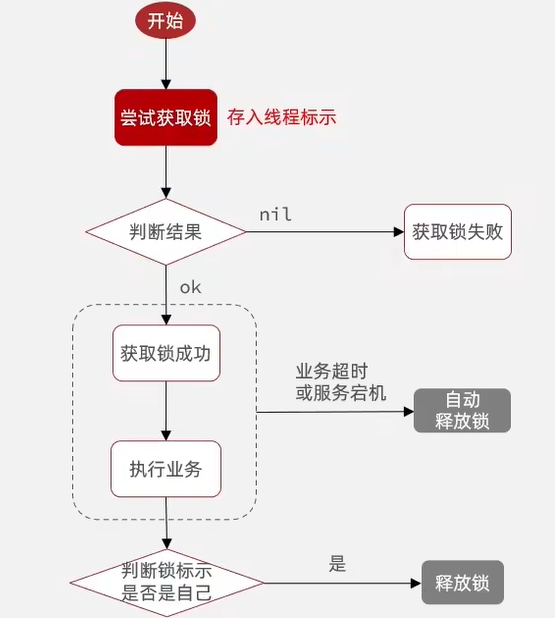

注意：标识不可以直接使用线程id 因为多台JVM的线程id 可能会一致重复
使用 UUID + 线程id 作为 分布式锁 的持有者标志

```java
package com.hmdp.utils;

import cn.hutool.core.lang.UUID;
import org.springframework.core.io.ClassPathResource;
import org.springframework.data.redis.core.StringRedisTemplate;
import org.springframework.data.redis.core.script.DefaultRedisScript;


import java.util.Collections;
import java.util.concurrent.TimeUnit;

public class SimpleRedisLock implements ILock{
    private String name;
    private StringRedisTemplate stringRedisTemplate;

    public SimpleRedisLock(String name, StringRedisTemplate stringRedisTemplate) {
        this.name = name;
        this.stringRedisTemplate = stringRedisTemplate;
    }

    private static final String KEY_PREFIX = "lock:";
    private static final String ID_PREFIX = UUID.randomUUID().toString(true) + "-";
    private static final DefaultRedisScript<Long> UNLOCK_SCRIPT;

    @Override
    public boolean tryLock(long timeoutSec) {
        // 获取线程表示
        long id = Thread.currentThread().getId();
        // 获取锁
        Boolean success = stringRedisTemplate.opsForValue().
                setIfAbsent(KEY_PREFIX + name, id + "", timeoutSec, TimeUnit.SECONDS);
        // 防止空指针
        return Boolean.TRUE.equals(success);
    }


    @Override
    public void unlock() {
        // 获取线程表示
        String threadId = ID_PREFIX + Thread.currentThread().getId();
        // 获取锁的标识
        String id = stringRedisTemplate.opsForValue().get(KEY_PREFIX + name);
        // 判断标识是否一致  判断是否是自己的锁
        if(threadId.equals(id)){
            // 释放锁
            stringRedisTemplate.delete(KEY_PREFIX + name);
        }
    }
}


```


# 第七版 GC 导致分布式锁失效、
释放锁阻塞 导致锁被其他业务拿走
阻塞完成后 该业务释放其他业务的锁


根本原因：判断锁标识和释放锁不是原子操作

解决方法 Lua 脚本 编写多条 redis 命令 原子执行

```java
package com.hmdp.utils;

import cn.hutool.core.lang.UUID;
import org.springframework.core.io.ClassPathResource;
import org.springframework.data.redis.core.StringRedisTemplate;
import org.springframework.data.redis.core.script.DefaultRedisScript;


import java.util.Collections;
import java.util.concurrent.TimeUnit;

public class SimpleRedisLock implements ILock{
    private String name;
    private StringRedisTemplate stringRedisTemplate;

    public SimpleRedisLock(String name, StringRedisTemplate stringRedisTemplate) {
        this.name = name;
        this.stringRedisTemplate = stringRedisTemplate;
    }

    private static final String KEY_PREFIX = "lock:";
    private static final String ID_PREFIX = UUID.randomUUID().toString(true) + "-";
    private static final DefaultRedisScript<Long> UNLOCK_SCRIPT;
    static {
        UNLOCK_SCRIPT = new DefaultRedisScript<>();
        UNLOCK_SCRIPT.setLocation(new ClassPathResource("unlock.lua"));
        UNLOCK_SCRIPT.setResultType(Long.class);
    }

    @Override
    public boolean tryLock(long timeoutSec) {
        // 获取线程表示
        long id = Thread.currentThread().getId();
        // 获取锁
        Boolean success = stringRedisTemplate.opsForValue().
                setIfAbsent(KEY_PREFIX + name, id + "", timeoutSec, TimeUnit.SECONDS);
        // 防止空指针
        return Boolean.TRUE.equals(success);
    }

    @Override
    public void unlock() {
        // 调用 lua 脚本
        stringRedisTemplate.execute(
                UNLOCK_SCRIPT,
                Collections.singletonList(KEY_PREFIX + name),
                ID_PREFIX + Thread.currentThread().getId());
    }

    @Override
    public void unlockLua() {

    }

//    @Override
//    public void unlockLua() {
//        // 调用 lua 脚本
//        stringRedisTemplate.execute(
//                UNLOCK_SCRIPT,
//                Collections.singletonList(KEY_PREFIX + name),
//                ID_PREFIX + Thread.currentThread().getId());
//    }


//    @Override
//    public void unlock() {
//        // 获取线程表示
//        String threadId = ID_PREFIX + Thread.currentThread().getId();
//        // 获取锁的标识
//        String id = stringRedisTemplate.opsForValue().get(KEY_PREFIX + name);
//        // 判断标识是否一致  判断是否是自己的锁
//        if(threadId.equals(id)){
//            // 释放锁
//            stringRedisTemplate.delete(KEY_PREFIX + name);
//        }
//    }
}

```


# 优化 Redis Set nx 实现分布式锁的 问题 -> 使用 Redisson

问题1 不可重入
问题2 不可重试
问题3 超时释放
问题4 主从一致

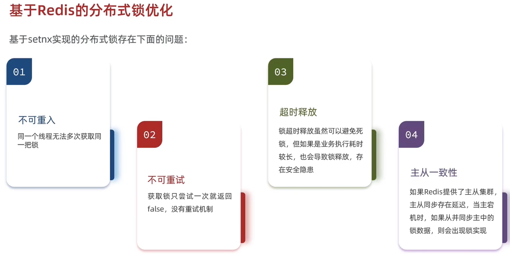

# Redisson 快速入门 -> 之前学的可以不用

使用 Redisson 的锁 替换 自己实现的分布式锁

```java
// 第六版 利用 Redisson 实现 分布式锁 解决分布式下 一人一单问题
@Override
public Result seckillVoucher(Long voucherId) {
    // 1 获取优惠券
    SeckillVoucher voucher = seckillVoucherService.getById(voucherId);
    // 2 判断秒杀是否开始
    if(voucher.getBeginTime().isAfter(LocalDateTime.now())){
        return Result.fail("秒杀尚未开始");
    }
    // 3 判断秒杀是否结束
    if(voucher.getEndTime().isBefore(LocalDateTime.now())){
        return Result.fail("秒杀已经结束");
    }
    // 4 判断库存是否充足
    if (voucher.getStock() < 1) {
        return Result.fail("库存不足");
    }


    Long userId = UserHolder.getUser().getId();
    // 使用 Redisson 分布式锁
    RLock lock = redissonClient.getLock("lock:redisson:order:" + userId);
    // 使用无参方法  只尝试获取一次锁  失败即返回
    boolean isLock = lock.tryLock();
    if (!isLock) {
        return Result.fail("不允许重复下单");
    }
    try {
        IVoucherOrderService proxy = (IVoucherOrderService) AopContext.currentProxy();
        return proxy.createVoucherOrder(voucherId);
    }finally {
        lock.unlock();
    }

}
```


# Redisson原理01 分布式锁可重入的底层原理
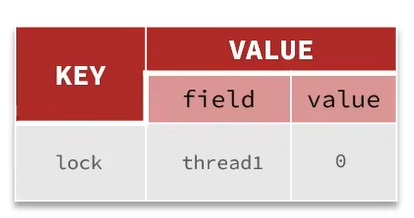
使用 hash 结构 存储线程标识 + 重入次数

底层原理 ： hash结构 + lua 脚本

当重入次数为 0 
其他线程可以获得锁
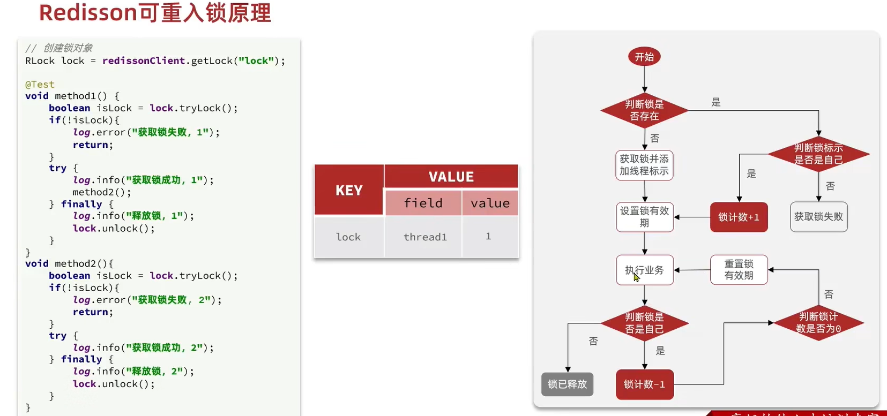

redisson tryLock() 方法源码
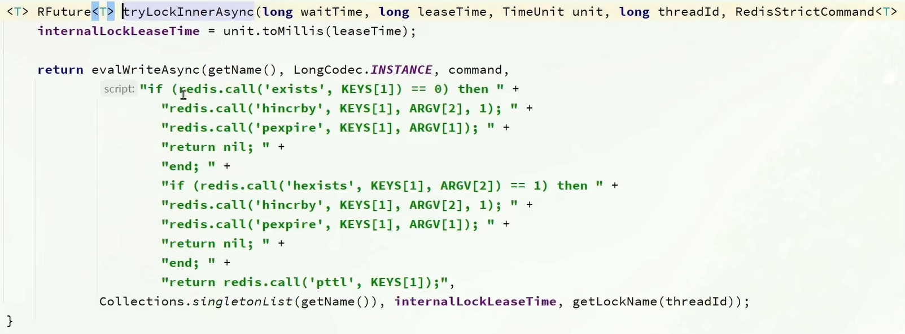

redisson unlock() 方法源码
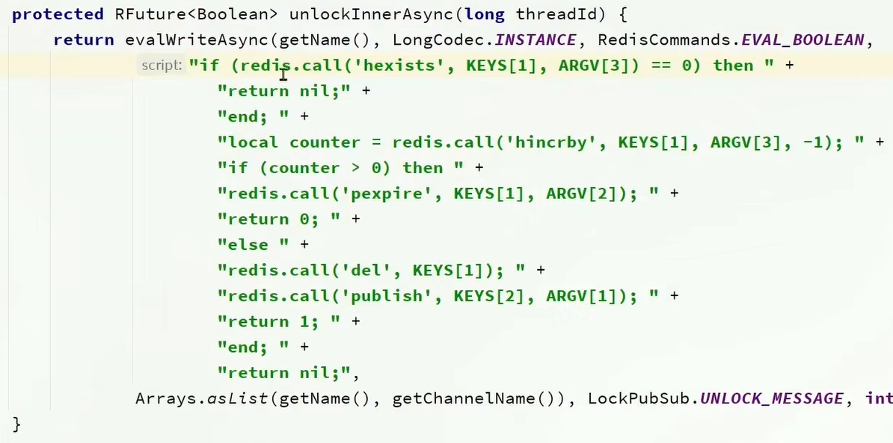

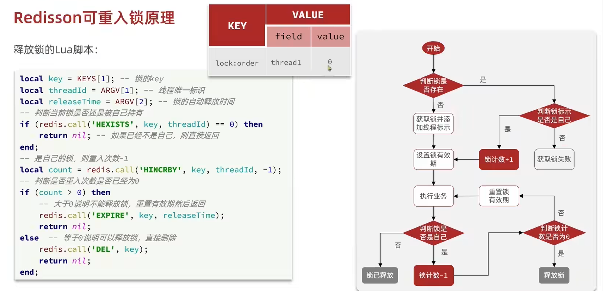

# Redisson原理02 分布式锁可重试的底层原理

在 10 秒中获取不到锁 会一直重试
```java
    Long userId = UserHolder.getUser().getId();
    // 使用 Redisson 分布式锁
    RLock lock = redissonClient.getLock("lock:redisson:order:" + userId);
    // 使用无参方法  只尝试获取一次锁  失败即返回
    boolean isLock = lock.tryLock(10L, TimeUnit.SECONDS);
    if (!isLock) {
        return Result.fail("不允许重复下单");
    }
    try {
        IVoucherOrderService proxy = (IVoucherOrderService) AopContext.currentProxy();
        return proxy.createVoucherOrder(voucherId);
    }finally {
        lock.unlock();
    }
```

原理：自己看源代码
大概：Future 返回 ttl，然后判断ttl的时间，是否还足够进行一次重试，
然后等待一会，再次重试   （发布订阅模式）

# Redisson原理03 分布式锁超时释放+自动续期的底层原理

看门狗机制：30秒 每次加 10 秒

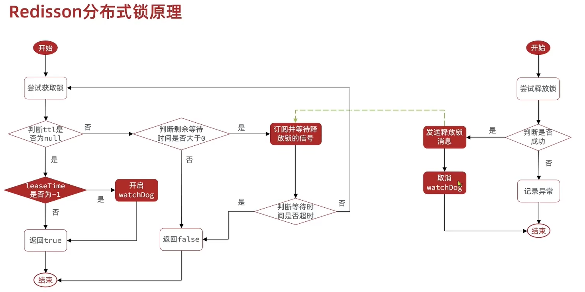

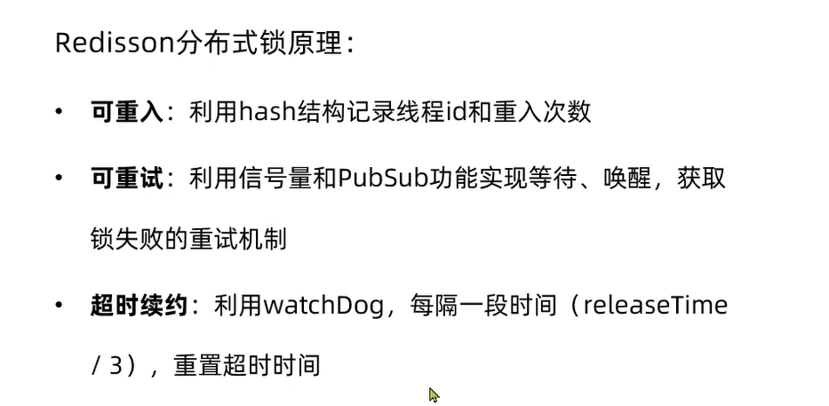


# Redisson原理04 分布式锁主从一致底层原理
多个独立的Redis节点
必须获取每一个主节点的 lock 才算获取锁成功

而每个锁也支持可重入特性

名词： 连锁
可以只使用多个主节点间，可以为每个主节点配置多个从节点
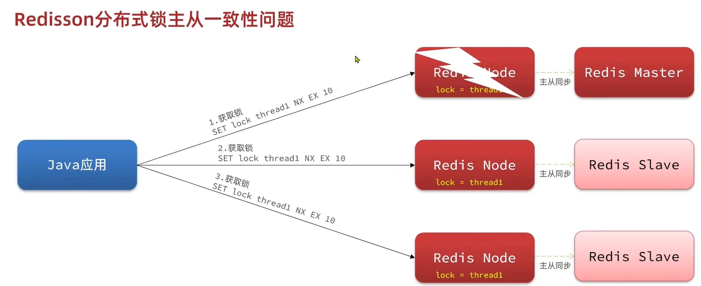


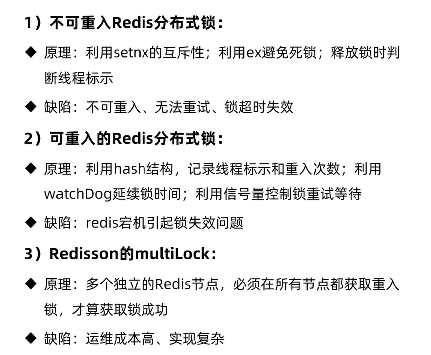


# 秒杀优化

优化策略
在 Redis 中 实现库存校验 和 一人一单的校验 
然后开启独立线程处理其他业务

就比如很多人要去吃饭，可以优先让客户去抢号，抢到号码后，然后再去进行做饭等耗时的操作
而不是为每个客户都先去做饭，并且同步判断是否超卖
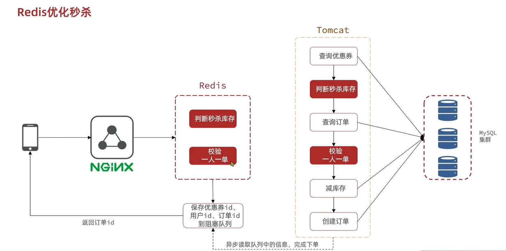

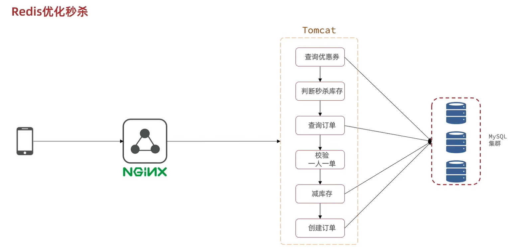


# 秒杀优化需求分析
仅判断是否有秒杀资格
有 返回 0 -> 生成订单、下单、扣库存 等一些列操作
无 返回 1 2 -> 直接返回

开启独立线程写入数据库
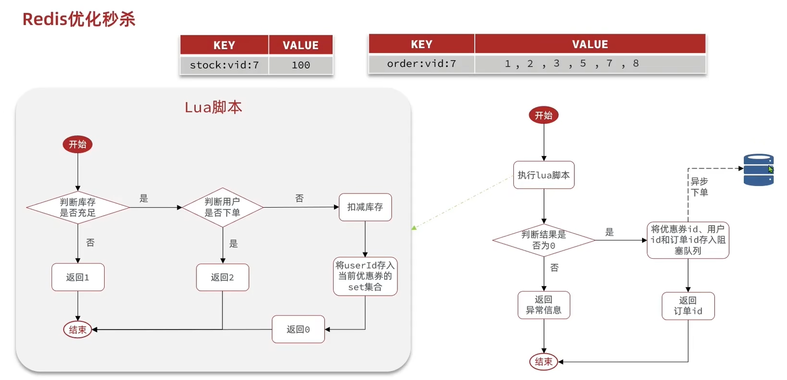

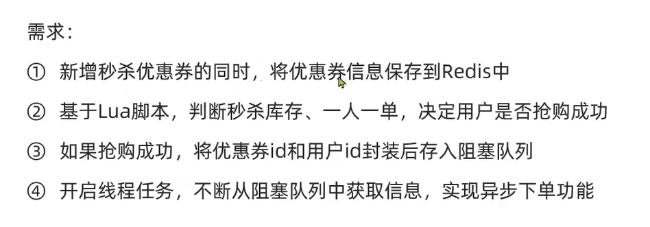

# 秒杀优化具体实现
阻塞队列实现
问题：JVM内存占用过多
数据安全问题

```java
package com.hmdp.service.impl;

import cn.hutool.core.bean.BeanUtil;
import com.hmdp.dto.Result;
import com.hmdp.entity.SeckillVoucher;
import com.hmdp.entity.VoucherOrder;
import com.hmdp.mapper.VoucherOrderMapper;
import com.hmdp.service.ISeckillVoucherService;
import com.hmdp.service.IVoucherOrderService;
import com.baomidou.mybatisplus.extension.service.impl.ServiceImpl;
import com.hmdp.utils.RedisIdWorker;
import com.hmdp.utils.SimpleRedisLock;
import com.hmdp.utils.UserHolder;
import lombok.extern.slf4j.Slf4j;
import org.redisson.api.RLock;
import org.redisson.api.RedissonClient;
import org.springframework.aop.framework.AopContext;
import org.springframework.core.io.ClassPathResource;
import org.springframework.data.redis.connection.stream.*;
import org.springframework.data.redis.core.StringRedisTemplate;
import org.springframework.data.redis.core.script.DefaultRedisScript;
import org.springframework.stereotype.Service;
import org.springframework.transaction.annotation.Transactional;

import javax.annotation.PostConstruct;
import javax.annotation.Resource;
import java.time.Duration;
import java.time.LocalDateTime;
import java.util.Collections;
import java.util.List;
import java.util.Map;
import java.util.concurrent.*;

import static com.hmdp.utils.RedisConstants.LOCK_ORDER_KEY;

/**
 * <p>
 *  服务实现类
 * </p>
 *
 * @author 虎哥
 * @since 2021-12-22
 */
@Service
@Slf4j
public class VoucherOrderServiceImpl extends ServiceImpl<VoucherOrderMapper, VoucherOrder> implements IVoucherOrderService {

    @Resource
    private ISeckillVoucherService seckillVoucherService;

    // 注入 全局唯一 id 生成器
    // 可以传入参数 prefix 作为不同业务的 全局唯一 id生成器
    // 此处主要用于生成 全局唯一 优惠券订单id
    @Resource
    private RedisIdWorker redisIdWorker;

    @Resource
    StringRedisTemplate stringRedisTemplate;

    @Resource
    RedissonClient redissonClient;

    // 获取代理对象
    private IVoucherOrderService proxy;


    // 加载 lua 脚本
    private static final DefaultRedisScript<Long> SECKILL_SCRIPT;
    static {
        SECKILL_SCRIPT = new DefaultRedisScript<>();
        SECKILL_SCRIPT.setLocation(new ClassPathResource("seckill.lua"));
        SECKILL_SCRIPT.setResultType(Long.class);
    }

    // 下面两行代码 -> 阻塞队列 + 线程池 在 seckillVoucher 判断用户具有秒杀资格后 异步处理下单的剩余操作
    // 保存异步下单任务到阻塞队列
    private BlockingQueue<VoucherOrder> orderTasks = new ArrayBlockingQueue<>(1024 * 1024);
    // 创建线程池 创建订单、下单 并持久化到数据库
    private static final ExecutorService SECKILL_ORDER_EXECUTOR = Executors.newSingleThreadExecutor();

    @PostConstruct
    private void init(){
        SECKILL_ORDER_EXECUTOR.submit(new VoucherOrderHandler());
    }

    private class VoucherOrderHandler implements Runnable{

        @Override
        public void run() {
            while (true) {
                try {
                    // 1 从队列获取一个订单信息
                    VoucherOrder voucherOrder = orderTasks.take();
                    // 2 创建订单
                    handleVoucherOrder(voucherOrder);
                } catch (Exception e) {
                    log.error("处理订单异常", e);
                }
            }
        }


    }

    private void handleVoucherOrder(VoucherOrder voucherOrder) {
        // 1 获取用户
        Long userId = voucherOrder.getUserId();
        // 2 创建锁对象
        RLock lock = redissonClient.getLock("lock:order:" + userId);
        // 3 获取锁
        // 使用无参方法 失败直接返回
        boolean isLock = lock.tryLock();
        // 4 判断锁是否成功
        if(!isLock){
            // 获取锁失败 返回错误或者重试
            log.error("不允许重复下单");
            return;
        }try {
            // 创建订单 更新库存 保存订单到数据库
            proxy.createVoucherOrder(voucherOrder);
        }finally {
            // 释放锁
            lock.unlock();
        }
    }

    // 第七版 使用 Lua 脚本 异步下单优化  在redis实现 库存判断 + 一人一单
    // 终极方案
    @Override
    public Result seckillVoucher(Long voucherId) {
        // 获取用户
        Long userId = UserHolder.getUser().getId();
        // 1 执行 lua 脚本
        Long result = stringRedisTemplate.execute(
                SECKILL_SCRIPT,
                Collections.emptyList(),
                voucherId.toString(), userId.toString()
        );
        // 判断结果是否是 0
        int r = result.intValue();
        if(r != 0){
            // 不是0 代表没有购买资格
            return Result.fail(r == 1 ? "库存不足" : "不能重复下单");
        }
        // 2.2 为 0 有购买资格  把下单信息保存到阻塞队列
        VoucherOrder voucherOrder = new VoucherOrder();
        // 2.3 订单 id
        long orderId = redisIdWorker.nextId("order");
        voucherOrder.setId(orderId);
        // 2.4 用户 id
        voucherOrder.setUserId(userId);
        // 2.5 代金券id
        voucherOrder.setVoucherId(voucherId);
        // 2.6 放入阻塞队列
        orderTasks.add(voucherOrder);

        // 3 获取代理对象  初始化成员变量proxy
        proxy = (IVoucherOrderService) AopContext.currentProxy();

        // 4 返回订单 id
        return Result.ok(orderId);
    }
    // 秒杀优化
    @Transactional
    public void createVoucherOrder(VoucherOrder voucherOrder) {
        // 5 一人一单
        Long userId = voucherOrder.getUserId();
        Long voucherId = voucherOrder.getVoucherId();


        int count = query().eq("user_id", userId).eq("voucher_id", voucherId).count();
        if (count > 0) {
            // 用户已经购买过了
            log.error("用户已经购买过一次");
            return;
        }

        // 6 扣减库存
        boolean success = seckillVoucherService.update()
                .setSql("stock = stock - 1")
                .eq("voucher_id", voucherId).gt("stock", 0)
                .update();
        if (!success) {
            log.error("库存不足");
            return;
        }

        save(voucherOrder);
    }
}

```

使用Java内存实现阻塞队列的存在的问题
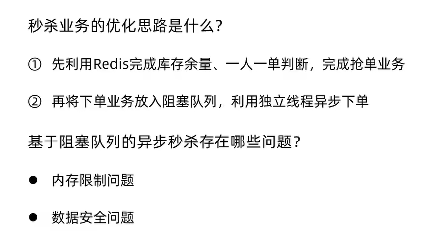

jvm内存没有持久化机制


# 使用 RabbitMQ 实现异步下单
```java
package com.hmdp.service.impl;

import cn.hutool.core.bean.BeanUtil;
import com.hmdp.dto.Result;
import com.hmdp.entity.SeckillVoucher;
import com.hmdp.entity.VoucherOrder;
import com.hmdp.mapper.VoucherOrderMapper;
import com.hmdp.service.ISeckillVoucherService;
import com.hmdp.service.IVoucherOrderService;
import com.baomidou.mybatisplus.extension.service.impl.ServiceImpl;
import com.hmdp.utils.RedisIdWorker;
import com.hmdp.utils.SimpleRedisLock;
import com.hmdp.utils.UserHolder;
import lombok.extern.slf4j.Slf4j;
import org.redisson.api.RLock;
import org.redisson.api.RedissonClient;
import org.springframework.amqp.core.ExchangeTypes;
import org.springframework.amqp.rabbit.annotation.Exchange;
import org.springframework.amqp.rabbit.annotation.Queue;
import org.springframework.amqp.rabbit.annotation.QueueBinding;
import org.springframework.amqp.rabbit.annotation.RabbitListener;
import org.springframework.amqp.rabbit.core.RabbitTemplate;
import org.springframework.aop.framework.AopContext;
import org.springframework.core.io.ClassPathResource;
import org.springframework.data.redis.connection.stream.*;
import org.springframework.data.redis.core.StringRedisTemplate;
import org.springframework.data.redis.core.script.DefaultRedisScript;
import org.springframework.stereotype.Service;
import org.springframework.transaction.annotation.Transactional;

import javax.annotation.PostConstruct;
import javax.annotation.Resource;
import java.time.Duration;
import java.time.LocalDateTime;
import java.util.Collections;
import java.util.List;
import java.util.Map;
import java.util.concurrent.*;

import static com.hmdp.utils.RedisConstants.LOCK_ORDER_KEY;

/**
 * <p>
 *  服务实现类
 * </p>
 *
 * @author 虎哥
 * @since 2021-12-22
 */
@Service
@Slf4j
public class VoucherOrderServiceImpl extends ServiceImpl<VoucherOrderMapper, VoucherOrder> implements IVoucherOrderService {

    @Resource
    private ISeckillVoucherService seckillVoucherService;

    // 注入 全局唯一 id 生成器
    // 可以传入参数 prefix 作为不同业务的 全局唯一 id生成器
    // 此处主要用于生成 全局唯一 优惠券订单id
    @Resource
    private RedisIdWorker redisIdWorker;

    @Resource
    StringRedisTemplate stringRedisTemplate;

    @Resource
    private RabbitTemplate rabbitTemplate;

    @Resource
    RedissonClient redissonClient;


    // 加载 lua 脚本
    private static final DefaultRedisScript<Long> SECKILL_SCRIPT;
    static {
        SECKILL_SCRIPT = new DefaultRedisScript<>();
        SECKILL_SCRIPT.setLocation(new ClassPathResource("seckill.lua"));
        SECKILL_SCRIPT.setResultType(Long.class);
    }


    @Override
    public Result seckillVoucher(Long voucherId) {
        //1.执行lua脚本，判断当前用户的购买资格
        Long userId = UserHolder.getUser().getId();
        Long result = stringRedisTemplate.execute(
                SECKILL_SCRIPT,
                Collections.emptyList(),
                voucherId.toString(), userId.toString());
        if (result != 0) {
            // 2.不为0说明没有购买资格
            return Result.fail(result == 1 ? "库存不足" : "不能重复下单");
        }
        // 3.走到这一步说明有购买资格，将订单信息存到消息队列
        VoucherOrder voucherOrder = new VoucherOrder();
        long orderId = redisIdWorker.nextId("order");
        voucherOrder.setId(orderId);
        voucherOrder.setUserId(UserHolder.getUser().getId());
        voucherOrder.setVoucherId(voucherId);
        //存入消息队列等待异步消费
        rabbitTemplate.convertAndSend("hmdianping.direct","direct.seckill",voucherOrder);
        return Result.ok(orderId);
    }

    // 创建订单消费者
    @RabbitListener(bindings = @QueueBinding(
        value = @Queue(name = "direct.seckill.queue"),
        key = "direct.seckill",
        exchange = @Exchange(name = "hmdianping.direct", type = ExchangeTypes.DIRECT)
    ))
    public void listenOrderCreate(VoucherOrder voucherOrder) {
        try {
            System.out.println("消费者异步创建订单");
            // 处理订单创建
            handleVoucherOrder(voucherOrder);
        } catch (Exception e) {
            log.error("处理订单异常", e);
            // 可以添加重试逻辑或错误处理
        }
    }

    private void handleVoucherOrder(VoucherOrder voucherOrder) {
        // 1.获取用户
        Long userId = voucherOrder.getUserId();
        // 2.创建锁对象
        RLock lock = redissonClient.getLock("lock:order:" + userId);
        // 3.获取锁
        boolean isLock = lock.tryLock();
        // 4.判断锁是否成功
        if (!isLock) {
            // 获取锁失败 返回错误或者重试
            log.error("不允许重复下单");
            return;
        }
        try {
            // 获取代理对象
            IVoucherOrderService proxy = (IVoucherOrderService) AopContext.currentProxy();
            // 创建订单 更新库存 保存订单到数据库
            proxy.createVoucherOrder(voucherOrder);
        } finally {
            // 释放锁
            lock.unlock();
        }
    }


    // 秒杀优化
    @Transactional
    public void createVoucherOrder(VoucherOrder voucherOrder) {
        // 5 一人一单
        Long userId = voucherOrder.getUserId();
        Long voucherId = voucherOrder.getVoucherId();


        int count = query().eq("user_id", userId).eq("voucher_id", voucherId).count();
        if (count > 0) {
            // 用户已经购买过了
            log.error("用户已经购买过一次");
            return;
        }

        // 6 扣减库存
        boolean success = seckillVoucherService.update()
                .setSql("stock = stock - 1")
                .eq("voucher_id", voucherId).gt("stock", 0)
                .update();
        if (!success) {
            log.error("库存不足");
            return;
        }

        save(voucherOrder);
    }


}

```


