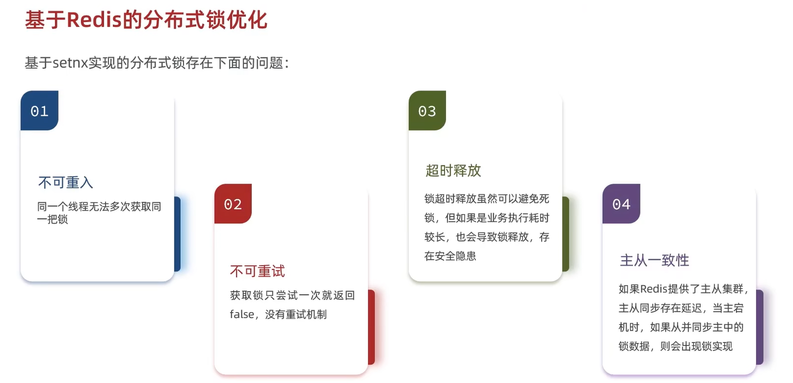
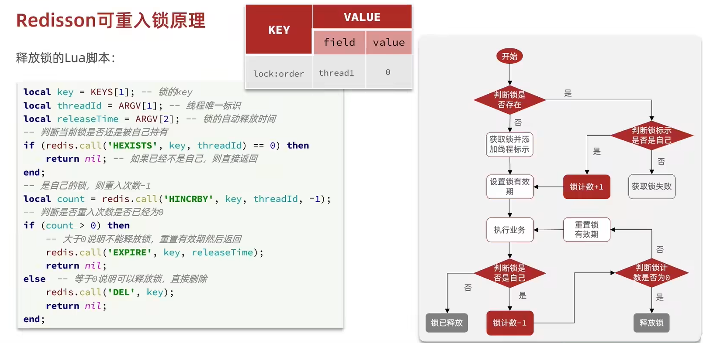

# 解决 使用 redis 中 set nx 命令实现分布式锁 四个缺点
使用 Redisson 中 封装的方法 解决 或者自己 使用 lua 脚本解决


# 实战篇-19 Redisson 可重入锁原理
锁的结构在 key 和 线程id 的基础上 加上重入的次数
使用 hash 结构

        filed       value
key     0x1231231     6

但是由于 hash 结构不像 string 结构那样 可以同时设置 nx 和 ex
所以要使用 lua 脚本 保证 判断锁是不是自己的 和 释放锁 的原子性



redisson 实际上底层代码 就是 用 lua 脚本实现的

# hyperloglog 实现 UV 访客数量
```redis
PFADD uv e1 e2 e3

PFCOUNT uv
```


# 实现点赞
```java
public Result likeBlogYan(Long id) {
    Long userId = UserHolder.getUser().getId();
    String key = RedisConstants.BLOG_LIKED_KEY + id;
    Boolean isMember = stringRedisTemplate.opsForSet().isMember(key, userId);
    if(BooleanUtil.isFalse(isMember)){
        boolean isSuccess = update().setSql("liked = liked + 1").eq("id", id).update();
        if(isSuccess) {
            stringRedisTemplate.opsForSet().add(key, String.valueOf(userId));
        }
    }else{
        boolean isSuccess = update().setSql("liked = liked - 1").eq("id", id).update();
        if(isSuccess) {
            stringRedisTemplate.opsForSet().remove(key, userId.toString());
        }
    }
    return Result.ok();
}
```

# 点赞排行榜
**stream 流的使用要熟练**
**zset 没有根据 field 判断是否存在数据 **
```java
// 查询排行榜 top5
@Override
public Result queryBlogLikesById(Long id) {
    String key = RedisConstants.BLOG_LIKED_KEY + id;
    //查询top5的点赞用户
    Set<String> top5 = stringRedisTemplate.opsForZSet().range(key, 0, 4);
    if (top5 == null || top5.isEmpty()){
        return Result.ok(Collections.emptyList());
    }
    // 2、解析出用户id
    List<Long> userIds = top5.stream().map(Long::valueOf).collect(Collectors.toList());
    // 写出 SQL 语句
    String join = StrUtil.join(",", userIds);       //  "5, 1, 4"
    //根据id查询用户  where id in (5, 1, 4) order by filed(id, 5, 1, 4)
    List<UserDTO> userDTOS = userService.lambdaQuery()
            .in(User::getId,userIds)
            .last("order by field(id,"+join+")")
            .list()
            .stream().map(user ->
                    BeanUtil.copyProperties(user, UserDTO.class)
            ).collect(Collectors.toList());
    //返回
    return Result.ok(userDTOS);
}
```
