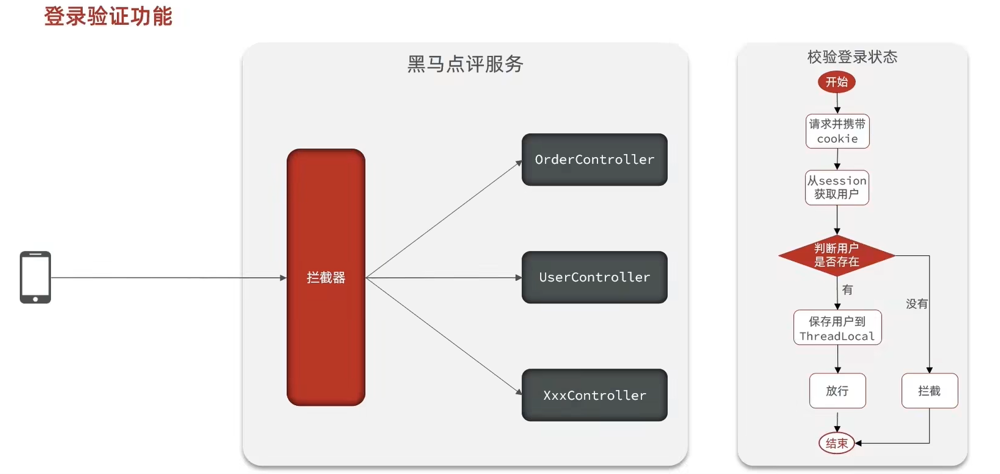
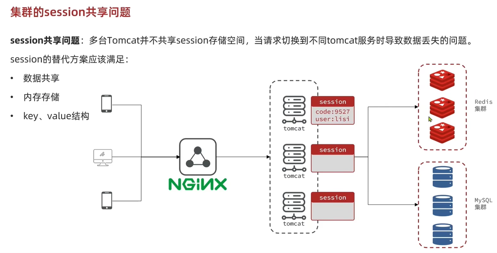

# 基于 Session 的短信验证码登录
```java

@Override
public Result sendCode(String phone, HttpSession session) {
    // 1. 校验手机号
    if(RegexUtils.isPhoneInvalid(phone)){
        // 2 不符合 返回错误信息
        return Result.fail("手机号格式错误");
    }
    // 3 保存 生成验证码
    String code = RandomUtil.randomNumbers(6);

    // 4 保存验证码到 session
    session.setAttribute("code", code);

    // 5 发送验证码
    log.debug("发送短信验证码成功 验证码 {}", code);
    return Result.ok();
}
```

# 登录
```java
@Override
public Result login(LoginFormDTO loginForm, HttpSession session) {
    // 1 校验手机号
    String phone = loginForm.getPhone();
    // 1. 校验手机号
    if(RegexUtils.isPhoneInvalid(phone)){
        // 2 不符合 返回错误信息
        return Result.fail("手机号格式错误");
    }

    // 2 校验验证码
    Object cacheCode = session.getAttribute("code");
    String code = loginForm.getCode();
    if(cacheCode == null || !cacheCode.toString().equals(code)){
        // 3 不一致 报错
        return Result.fail("验证码错误");
    }


    // 4 一致 根据手机号查询用户
    User user = query().eq("phone", phone).one();

    // 5 判断用户是否存在
    if(user == null){
        // 6 不存在 创建新用户
        user = createUserWithPhone(phone);
    }
    // 7 存在 保存用户到 session
    session.setAttribute("user", user);
    return Result.ok();
}

private User createUserWithPhone(String phone) {
    // 1 创建用户
    User user = new User();
    user.setPhone(phone);
    user.setNickName(USER_NICK_NAME_PREFIX + RandomUtil.randomString(10));
    save(user);
    return user;

}
```

# 登录校验



# redis 代替 tomcat 中的 session
