# 基于 Session 的短信验证码登录
```java

@Override
public Result sendCode(String phone, HttpSession session) {
    // 1. 校验手机号
    if(RegexUtils.isPhoneInvalid(phone)){
        // 2 不符合 返回错误信息
        return Result.fail("手机号格式错误");
    }
    // 3 保存 生成验证码
    String code = RandomUtil.randomNumbers(6);

    // 4 保存验证码到 session
    session.setAttribute("code", code);

    // 5 发送验证码
    log.debug("发送短信验证码成功 验证码 {}", code);
    return Result.ok();
}
```

# 登录
```java
@Override
public Result login(LoginFormDTO loginForm, HttpSession session) {
    // 1 校验手机号
    String phone = loginForm.getPhone();
    // 1. 校验手机号
    if(RegexUtils.isPhoneInvalid(phone)){
        // 2 不符合 返回错误信息
        return Result.fail("手机号格式错误");
    }

    // 2 校验验证码
    Object cacheCode = session.getAttribute("code");
    String code = loginForm.getCode();
    if(cacheCode == null || !cacheCode.toString().equals(code)){
        // 3 不一致 报错
        return Result.fail("验证码错误");
    }


    // 4 一致 根据手机号查询用户
    User user = query().eq("phone", phone).one();

    // 5 判断用户是否存在
    if(user == null){
        // 6 不存在 创建新用户
        user = createUserWithPhone(phone);
    }
    // 7 存在 保存用户到 session
    session.setAttribute("user", user);
    return Result.ok();
}

private User createUserWithPhone(String phone) {
    // 1 创建用户
    User user = new User();
    user.setPhone(phone);
    user.setNickName(USER_NICK_NAME_PREFIX + RandomUtil.randomString(10));
    save(user);
    return user;

}
```

# 登录校验


# redis 代替 tomcat 中的 session


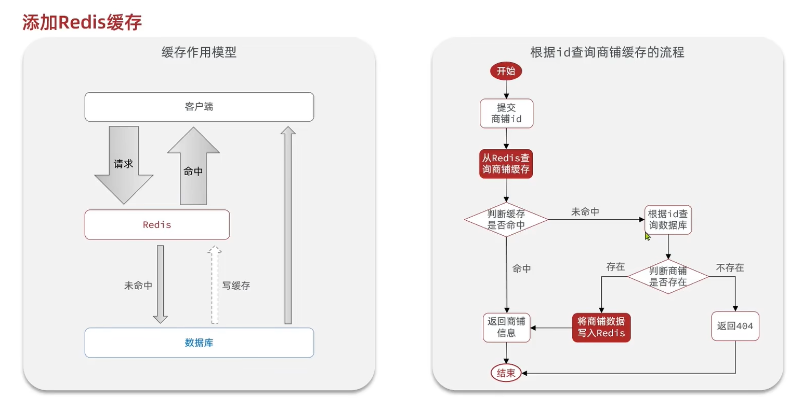

# 缓存更新策略
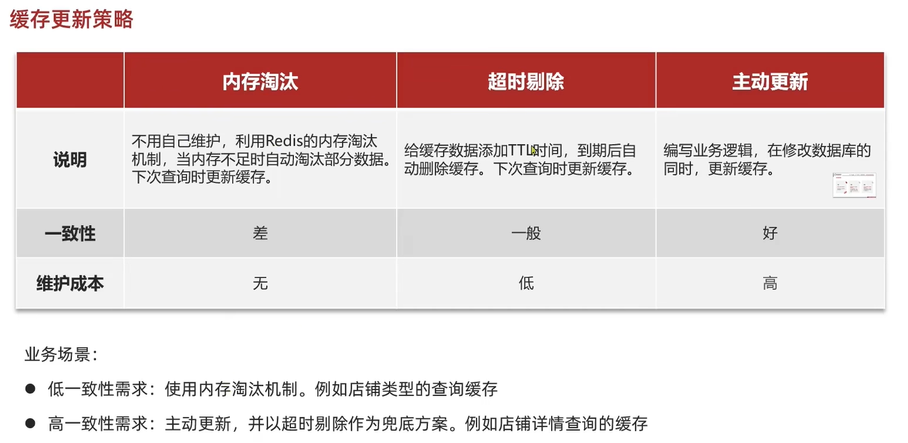

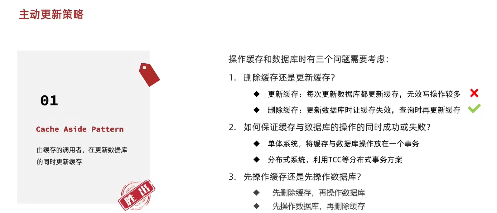

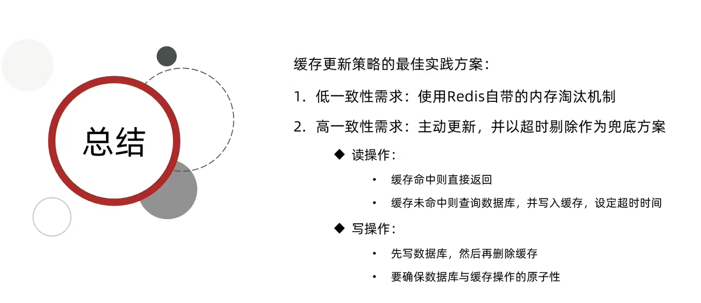


# 缓存穿透
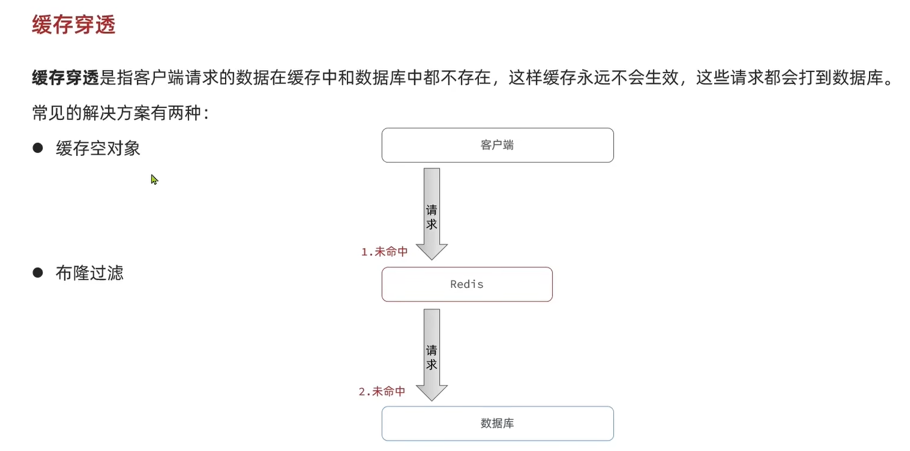
## 解决方法
- 缓存空对象
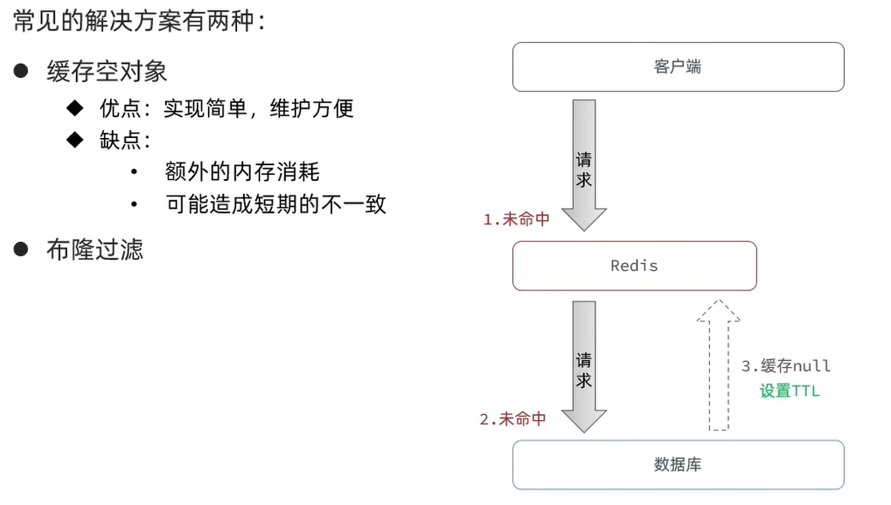
- 布隆过滤器
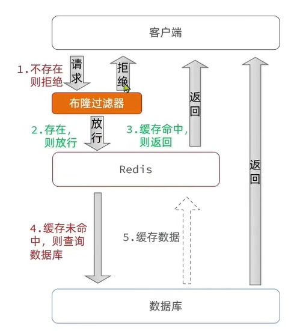

- 总结
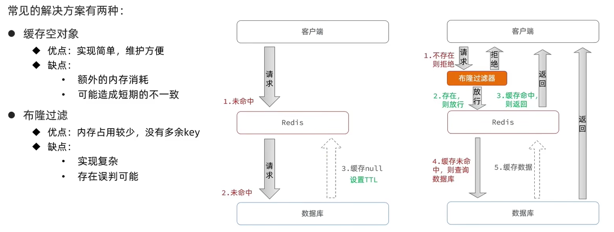

# 缓存穿透解决流程

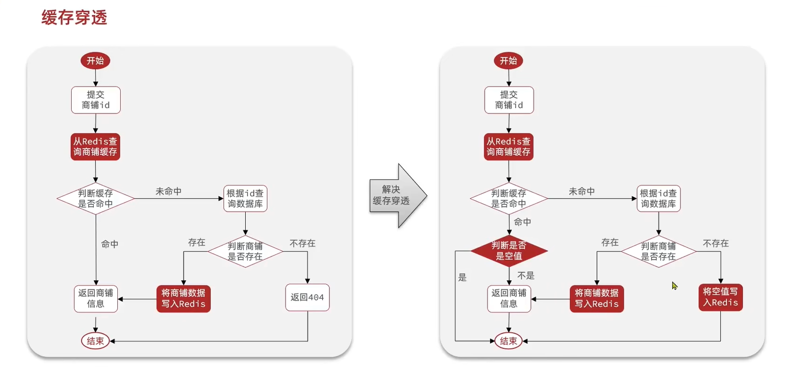


# 缓存雪崩
redis 宕机 或者 redis 大量的 Key 在同一时刻过期
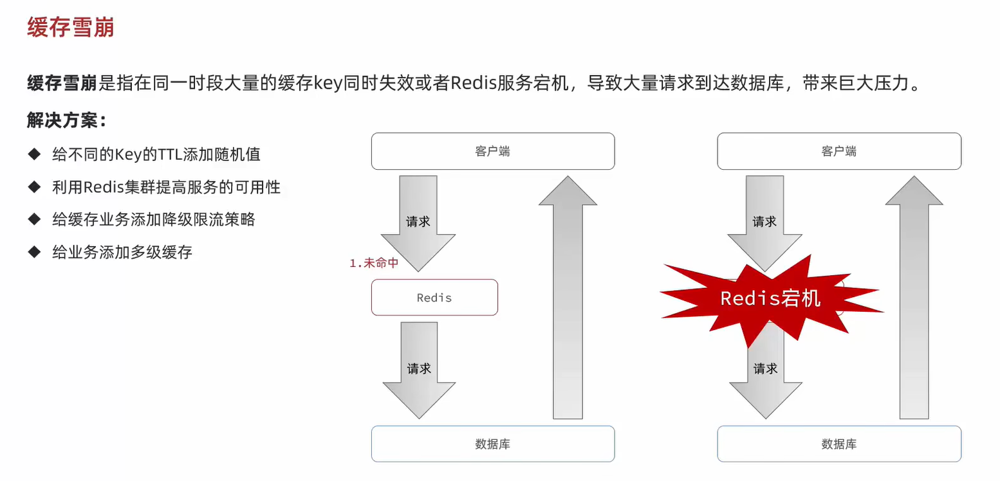

# 缓存击穿
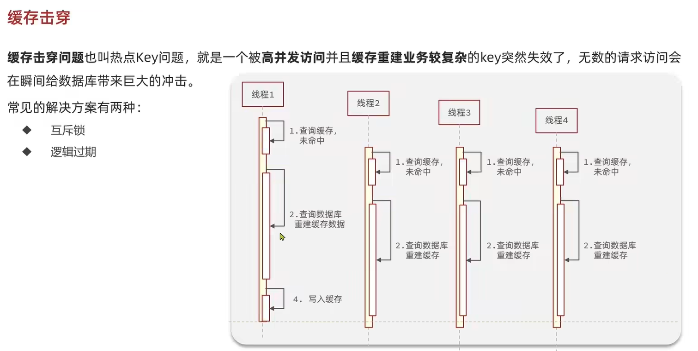

## 解决方法
- 互斥锁
- 逻辑过期
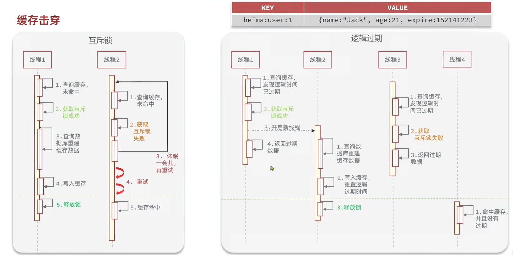

优缺点对比
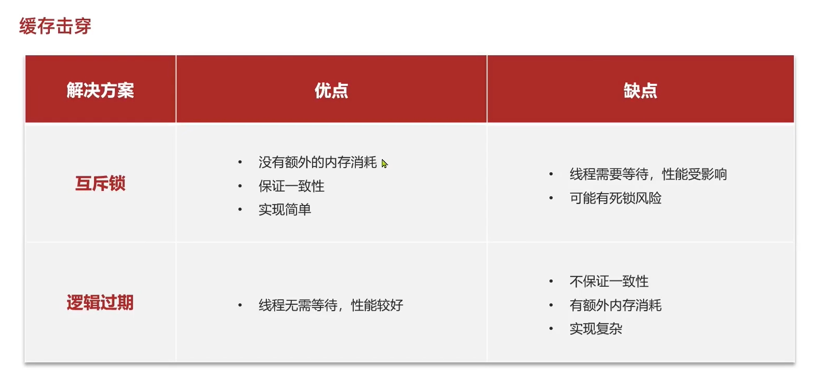

# 解决缓存击穿实例
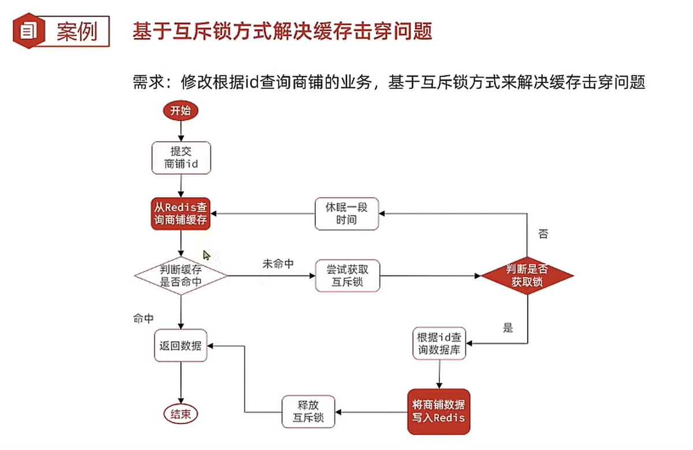


在Service实现类中添加以下方法
```java
// 添加锁
public boolean tryLock(String key){
    Boolean flag = stringRedisTemplate.opsForValue().setIfAbsent(key, "1", 10, TimeUnit.SECONDS);
    return BooleanUtil.isTrue(flag);
}

// 释放锁
public void unlock(String key){
    stringRedisTemplate.delete(key);
}
```


## 互斥锁解决缓存击穿
```java
public Result queryById(Long id) {
    // 缓存穿透
    // Shop shop = queryWithPassThrough(id);

    // 互斥锁解决缓存击穿
    Shop shop = queryWithMutex(id);
    if(shop == null){
        return Result.fail("店铺不存在");
    }
    return Result.ok(shop);
}

public Shop queryWithMutex(Long id){
    String key = CACHE_SHOP_KEY + id;
    // 1 从 redis 查询商铺缓存
    String shopJson = stringRedisTemplate.opsForValue().get("cache:shop:" + id);
    // 2 判断 redis 是否存在
    if (StrUtil.isNotBlank(shopJson)) {
        // 3 redis 中存在
        return JSONUtil.toBean(shopJson, Shop.class);
    }
    // 判断是否是空值
    if(shopJson != null){
        return null;
    }


    // 4 实现缓存重建
    // 4.1 获取互斥锁
    String lockKey = "lock:shop:" + id;
    Shop shop = null;
    try {
        boolean isLock = tryLock(lockKey);
        // 4.2 判断是否获取成功
        if(!isLock){
            // 4.3 失败 休眠并重启
            Thread.sleep(50);
            return queryWithMutex(id);
        }
        // 4.4 成功 根据 id 查询数据库
        shop = getById(id);
        // 模拟重建的延时
        Thread.sleep(200);

        // 5 不存在 返回错误
        if(shop == null){
            // 将空值写入 redis
            stringRedisTemplate.opsForValue().set(key, "", CACHE_NULL_TTL, TimeUnit.MINUTES);
            // 返回错误信息
            return null;
        }
        //  6 存在 写入 redis
        stringRedisTemplate.opsForValue().set(key, JSONUtil.toJsonStr(shop), CACHE_SHOP_TTL, TimeUnit.MINUTES);

    }catch (InterruptedException e){
        throw new RuntimeException(e);
    }finally {
        // 7 释放互斥锁
        unlock(lockKey);
    }
    // 8 返回
    return shop;
}


```


## 逻辑过期解决缓存击穿
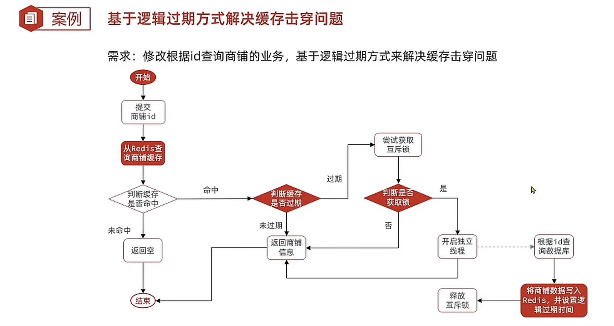
```java
private static final ExecutorService CACHE_REBUILD_EXECUTOR = Executors.newFixedThreadPool(10);

public Shop queryWithLoginExpire(Long id){
    String key = CACHE_SHOP_KEY + id;
    // 1 从 redis 查询商铺缓存
    String shopJson = stringRedisTemplate.opsForValue().get("cache:shop:" + id);
    // 2 判断 redis 是否存在
    if (StrUtil.isNotBlank(shopJson)) {
        return null;
    }

    // 4 命中 需要先把 json 反序列化 为对象
    RedisData redisData = JSONUtil.toBean(shopJson, RedisData.class);
    Shop shop = JSONUtil.toBean((JSONObject) redisData.getData(), Shop.class);
    LocalDateTime expireTime = redisData.getExpireTime();
    // 5 判断是否过期
    if(expireTime.isAfter(LocalDateTime.now())){
        // 5.1 未过期 返回店铺信息系
        return shop;
    }

    // 5.2 过期 需要缓存重建
    // 6 缓存重建
    // 6.1 获取互斥锁
    String lockKey = LOCK_SHOP_KEY + id;
    boolean isLock = tryLock(lockKey);
    // 6.2 判断是否获取锁成功
    if(isLock){
        // 6.3 成功 开启独立线程 实现缓存重建
        CACHE_REBUILD_EXECUTOR.submit(() -> {
            try {
                this.saveShop2Redis(id, 20L);
            }catch (Exception e){
                throw new RuntimeException(e);
            }finally {
                unlock(lockKey);
            }
        });
    }
    return shop;
}


```


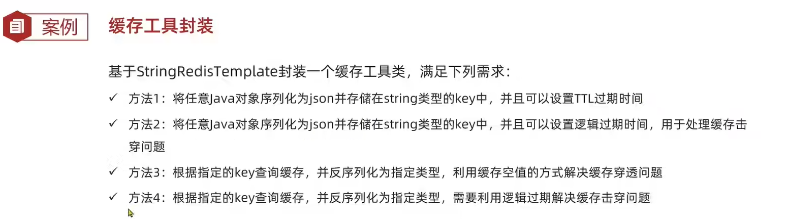


# 封装 Redis 工具类 <- 简化 缓存击穿的实现

```java
package com.hmdp.utils;

import cn.hutool.core.util.BooleanUtil;
import cn.hutool.core.util.StrUtil;
import cn.hutool.json.JSONObject;
import cn.hutool.json.JSONUtil;
import com.hmdp.entity.Shop;
import lombok.extern.slf4j.Slf4j;
import org.springframework.data.redis.core.StringRedisTemplate;
import org.springframework.stereotype.Component;

import java.time.LocalDateTime;
import java.util.concurrent.ExecutorService;
import java.util.concurrent.Executors;
import java.util.concurrent.TimeUnit;
import java.util.function.Function;

import static com.hmdp.utils.RedisConstants.*;

@Slf4j
@Component
public class CacheClient {
    private final StringRedisTemplate stringRedisTemplate;

    public CacheClient(StringRedisTemplate stringRedisTemplate) {
        this.stringRedisTemplate = stringRedisTemplate;
    }

    public void set(String key, Object value, Long time, TimeUnit unit){
        stringRedisTemplate.opsForValue().set(key, JSONUtil.toJsonStr(value), time, unit);
    }

    public void setWithLogicalExpire(String key, Object value, Long time, TimeUnit unit){
        // 设置逻辑过期
        RedisData redisData = new RedisData();
        redisData.setData(value);
        redisData.setExpireTime(LocalDateTime.now().plusSeconds(unit.toSeconds(time)));
        // 写入 Redis
        stringRedisTemplate.opsForValue().set(key, JSONUtil.toJsonStr(redisData));

    }


    public <R, ID> R queryWithPassThrough(
            String keyPrefix, ID id, Class<R> type, Function<ID, R> dbFallback, Long time, TimeUnit unit){
        String key = keyPrefix + id;
        // 1 从 redis 查询商铺缓存
        String json = stringRedisTemplate.opsForValue().get("cache:shop:" + id);
        // 2 判断 redis 是否存在
        if (StrUtil.isNotBlank(json)) {
            // 3 redis 中存在
            return JSONUtil.toBean(json, type);
        }
        // 判断是否是空值
        if(json != null){
            return null;
        }
        // 4 不存在 根据 id 查询数据库
        R r = dbFallback.apply(id);
        // 5 不存在 返回错误
        if(r == null){
            // 将空值写入 redis
            stringRedisTemplate.opsForValue().set(key, "", CACHE_NULL_TTL, TimeUnit.MINUTES);
            // 返回错误信息
            return null;
        }
        //  6 存在 写入 redis
        this.set(key, r, time, unit);
        // 7 返回
        return r;
    }


    private static final ExecutorService CACHE_REBUILD_EXECUTOR = Executors.newFixedThreadPool(10);

    public <R, ID> R queryWithLoginExpire(
            String keyPrefix, ID id, Class<R> type, Function<ID, R> dbFallback, Long time, TimeUnit unit){
        String key = keyPrefix + id;
        // 1 从 redis 查询商铺缓存
        String json = stringRedisTemplate.opsForValue().get(key);
        // 2 判断 redis 是否存在
        if (StrUtil.isBlank(json)) {
            return null;
        }

        // 4 命中 需要先把 json 反序列化 为对象
        RedisData redisData = JSONUtil.toBean(json, RedisData.class);
        R r = JSONUtil.toBean((JSONObject) redisData.getData(), type);
        LocalDateTime expireTime = redisData.getExpireTime();
        // 5 判断是否过期
        if(expireTime.isAfter(LocalDateTime.now())){
            // 5.1 未过期 返回店铺信息系
            return r;
        }

        // 5.2 过期 需要缓存重建
        // 6 缓存重建
        // 6.1 获取互斥锁
        String lockKey = LOCK_SHOP_KEY + id;
        boolean isLock = tryLock(lockKey);
        // 6.2 判断是否获取锁成功
        if(isLock){
            // 6.3 成功 开启独立线程 实现缓存重建
            CACHE_REBUILD_EXECUTOR.submit(() -> {
                try {
                    // 查询数据库
                    R r1 = dbFallback.apply(id);
                    // 写入 Redis
                    this.setWithLogicalExpire(key, r1, time, unit);
                }catch (Exception e){
                    throw new RuntimeException(e);
                }finally {
                    unlock(lockKey);
                }
            });
        }
        return r;
    }

    // 添加锁
    public boolean tryLock(String key){
        Boolean flag = stringRedisTemplate.opsForValue().setIfAbsent(key, "1", 10, TimeUnit.SECONDS);
        return BooleanUtil.isTrue(flag);
    }

    // 释放锁
    public void unlock(String key){
        stringRedisTemplate.delete(key);
    }
}


```

```java
@Service
public class ShopServiceImpl extends ServiceImpl<ShopMapper, Shop> implements IShopService {
    @Resource
    private StringRedisTemplate stringRedisTemplate;
    @Resource
    private CacheClient cacheClient;

    @Override
    public Result queryById(Long id) {
        // 缓存穿透
//        Shop shop = cacheClient.
//                queryWithPassThrough(CACHE_SHOP_KEY, id, Shop.class, this::getById, CACHE_SHOP_TTL, TimeUnit.MINUTES);

        // 互斥锁解决缓存击穿
        // Shop shop = queryWithMutex(id);

        // 逻辑过期解决缓存击穿问题
        Shop shop = cacheClient.
                queryWithLoginExpire(CACHE_SHOP_KEY, id, Shop.class, this::getById, 20L, TimeUnit.SECONDS);

        if(shop == null){
            return Result.fail("店铺不存在");
        }
        return Result.ok(shop);
    }

    @Override
    @Transactional
    public Result update(Shop shop) {
        Long id = shop.getId();
        if(id == null){
            return Result.fail("店铺id不能为空");
        }
        // 1 更新数据库
        updateById(shop);
        // 2 删除缓存
        stringRedisTemplate.delete(CACHE_SHOP_KEY + id);

        return Result.ok();
    }
}
```


# 第三章 秒杀优惠券
## ID 唯一性
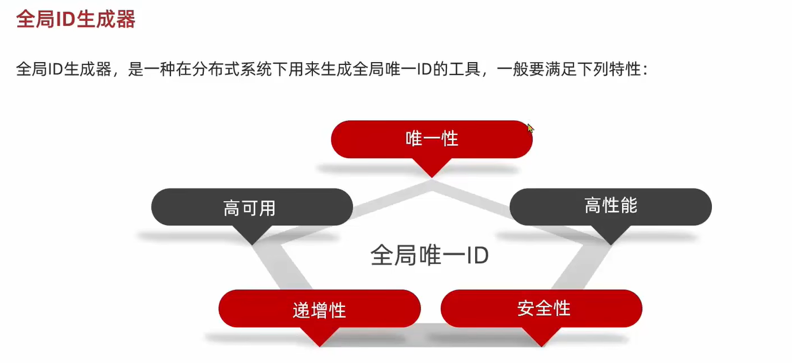

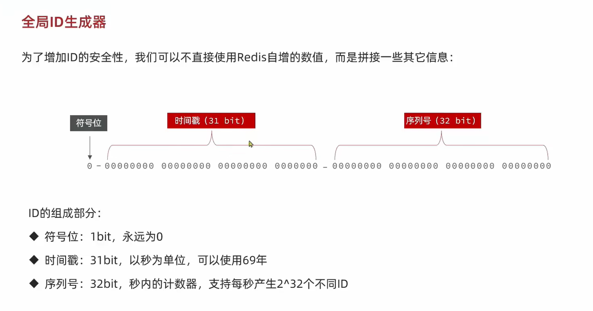

生成唯一 ID 的代码
```java

package com.hmdp.utils;


import org.springframework.data.redis.core.StringRedisTemplate;
import org.springframework.stereotype.Component;

import java.time.LocalDateTime;
import java.time.ZoneOffset;
import java.time.format.DateTimeFormatter;

@Component
public class RedisIdWorker {

    private static final long BEGIN_TIMESTAMP = 1640995200L;
    private static final int COUNT_BITS = 32;

    private StringRedisTemplate stringRedisTemplate;

    public RedisIdWorker(StringRedisTemplate stringRedisTemplate) {
        this.stringRedisTemplate = stringRedisTemplate;
    }

    // 1 bit 符号  +  31 bit 时间戳  +  32 bit 序列号
    public long nextId(String keyPrefix){
        // 1 生成时间戳
        LocalDateTime now = LocalDateTime.now();
        long nowSecond = now.toEpochSecond(ZoneOffset.UTC);
        long timestamp = nowSecond - BEGIN_TIMESTAMP;

        // 2 生成序列号
        // 2.1 获取当前日期 精确到天
        String date = now.format(DateTimeFormatter.ofPattern("yyyy:MM:dd"));
        // 2.2 自增长
        long count = stringRedisTemplate.opsForValue().increment("icr:" + keyPrefix + ":" + date);


        // 3 拼接并返回
        return timestamp << 32 | count;
    }

    public static void main(String[] args) {
        LocalDateTime time = LocalDateTime.of(2022, 1, 1, 0, 0, 0);
        long second = time.toEpochSecond(ZoneOffset.UTC);
        System.out.println("second = " + second);
    }

}

```
测试类代码
```java
package com.hmdp;

import com.hmdp.entity.Shop;
import com.hmdp.service.impl.ShopServiceImpl;
import com.hmdp.utils.CacheClient;
import com.hmdp.utils.RedisIdWorker;
import org.junit.jupiter.api.Test;
import org.springframework.boot.test.context.SpringBootTest;

import javax.annotation.Resource;
import java.util.concurrent.CountDownLatch;
import java.util.concurrent.ExecutorService;
import java.util.concurrent.Executors;
import java.util.concurrent.TimeUnit;

import static com.hmdp.utils.RedisConstants.CACHE_SHOP_KEY;

@SpringBootTest
class HmDianPingApplicationTests {

    @Resource
    RedisIdWorker redisIdWorker;

    private ExecutorService es = Executors.newFixedThreadPool(500);

    @Test
    void testIdWorker() throws InterruptedException {
        CountDownLatch latch = new CountDownLatch(300);

        Runnable task = () -> {
            for (int i = 0; i < 100; i++) {
                long id = redisIdWorker.nextId("order");
                System.out.println("id = " + id);
            }
            latch.countDown();
        };
        long begin = System.currentTimeMillis();
        for (int i = 0; i < 300; i++) {
            es.submit(task);
        }
        latch.await();
        long end = System.currentTimeMillis();
        System.out.println("time = " + (end - begin));
    }


}

```

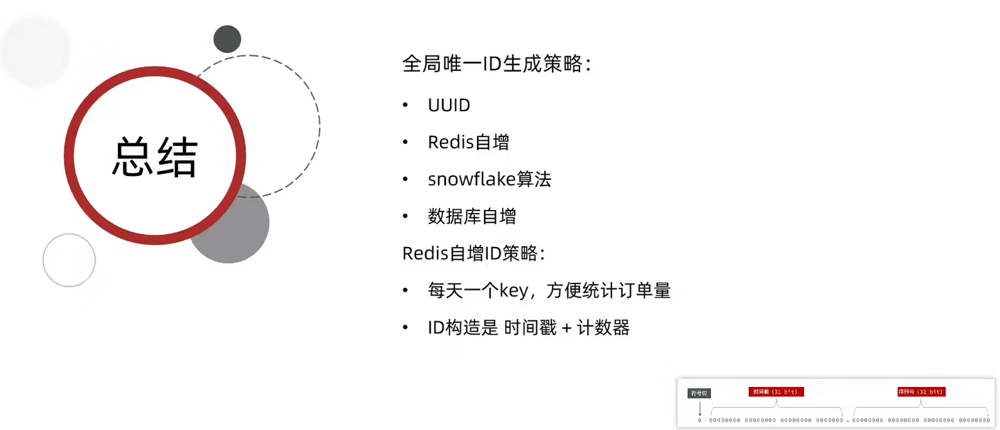

# 添加优惠券
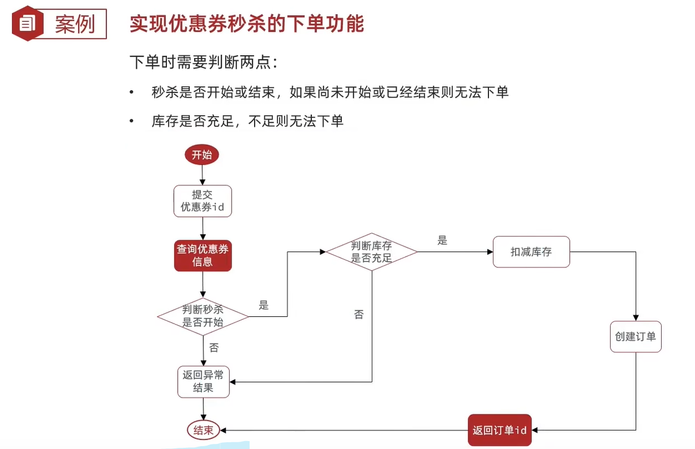

# 超卖问题
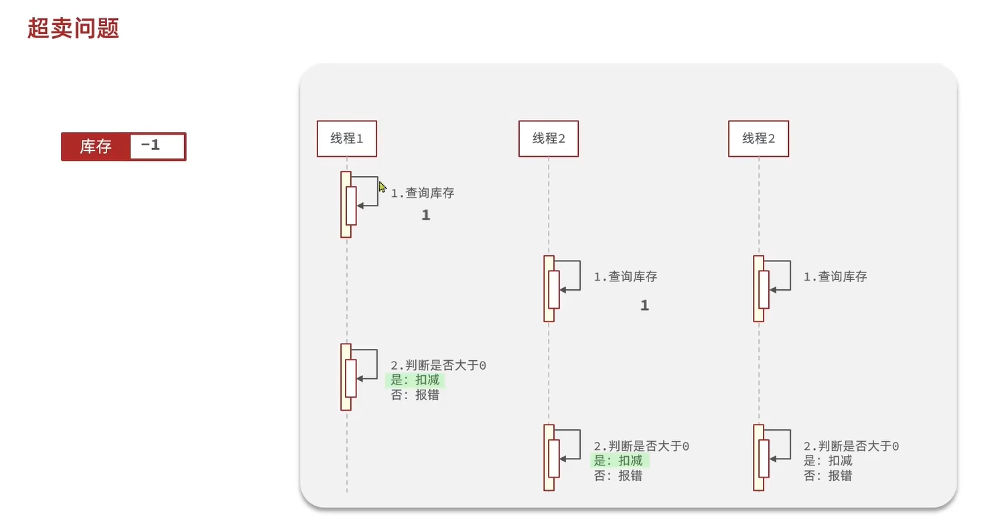