# 基于 Session 的短信验证码登录
```java

@Override
public Result sendCode(String phone, HttpSession session) {
    // 1. 校验手机号
    if(RegexUtils.isPhoneInvalid(phone)){
        // 2 不符合 返回错误信息
        return Result.fail("手机号格式错误");
    }
    // 3 保存 生成验证码
    String code = RandomUtil.randomNumbers(6);

    // 4 保存验证码到 session
    session.setAttribute("code", code);

    // 5 发送验证码
    log.debug("发送短信验证码成功 验证码 {}", code);
    return Result.ok();
}
```

# 登录
```java
@Override
public Result login(LoginFormDTO loginForm, HttpSession session) {
    // 1 校验手机号
    String phone = loginForm.getPhone();
    // 1. 校验手机号
    if(RegexUtils.isPhoneInvalid(phone)){
        // 2 不符合 返回错误信息
        return Result.fail("手机号格式错误");
    }

    // 2 校验验证码
    Object cacheCode = session.getAttribute("code");
    String code = loginForm.getCode();
    if(cacheCode == null || !cacheCode.toString().equals(code)){
        // 3 不一致 报错
        return Result.fail("验证码错误");
    }


    // 4 一致 根据手机号查询用户
    User user = query().eq("phone", phone).one();

    // 5 判断用户是否存在
    if(user == null){
        // 6 不存在 创建新用户
        user = createUserWithPhone(phone);
    }
    // 7 存在 保存用户到 session
    session.setAttribute("user", user);
    return Result.ok();
}

private User createUserWithPhone(String phone) {
    // 1 创建用户
    User user = new User();
    user.setPhone(phone);
    user.setNickName(USER_NICK_NAME_PREFIX + RandomUtil.randomString(10));
    save(user);
    return user;

}
```

# 登录校验


# redis 代替 tomcat 中的 session


# 缓存更新策略


# 缓存穿透

## 解决方法
- 缓存空对象

- 布隆过滤器


- 总结


# 缓存穿透解决流程


# 缓存雪崩
redis 宕机 或者 redis 大量的 Key 在同一时刻过期


# 缓存击穿


## 解决方法
- 互斥锁
- 逻辑过期


优缺点对比


# 解决缓存击穿实例


在Service实现类中添加以下方法
```java
// 添加锁
public boolean tryLock(String key){
    Boolean flag = stringRedisTemplate.opsForValue().setIfAbsent(key, "1", 10, TimeUnit.SECONDS);
    return BooleanUtil.isTrue(flag);
}

// 释放锁
public void unlock(String key){
    stringRedisTemplate.delete(key);
}
```


## 互斥锁解决缓存击穿
```java
public Result queryById(Long id) {
    // 缓存穿透
    // Shop shop = queryWithPassThrough(id);

    // 互斥锁解决缓存击穿
    Shop shop = queryWithMutex(id);
    if(shop == null){
        return Result.fail("店铺不存在");
    }
    return Result.ok(shop);
}

public Shop queryWithMutex(Long id){
    String key = CACHE_SHOP_KEY + id;
    // 1 从 redis 查询商铺缓存
    String shopJson = stringRedisTemplate.opsForValue().get("cache:shop:" + id);
    // 2 判断 redis 是否存在
    if (StrUtil.isNotBlank(shopJson)) {
        // 3 redis 中存在
        return JSONUtil.toBean(shopJson, Shop.class);
    }
    // 判断是否是空值
    if(shopJson != null){
        return null;
    }


    // 4 实现缓存重建
    // 4.1 获取互斥锁
    String lockKey = "lock:shop:" + id;
    Shop shop = null;
    try {
        boolean isLock = tryLock(lockKey);
        // 4.2 判断是否获取成功
        if(!isLock){
            // 4.3 失败 休眠并重启
            Thread.sleep(50);
            return queryWithMutex(id);
        }
        // 4.4 成功 根据 id 查询数据库
        shop = getById(id);
        // 模拟重建的延时
        Thread.sleep(200);

        // 5 不存在 返回错误
        if(shop == null){
            // 将空值写入 redis
            stringRedisTemplate.opsForValue().set(key, "", CACHE_NULL_TTL, TimeUnit.MINUTES);
            // 返回错误信息
            return null;
        }
        //  6 存在 写入 redis
        stringRedisTemplate.opsForValue().set(key, JSONUtil.toJsonStr(shop), CACHE_SHOP_TTL, TimeUnit.MINUTES);

    }catch (InterruptedException e){
        throw new RuntimeException(e);
    }finally {
        // 7 释放互斥锁
        unlock(lockKey);
    }
    // 8 返回
    return shop;
}


```


## 逻辑过期解决缓存击穿

```java
private static final ExecutorService CACHE_REBUILD_EXECUTOR = Executors.newFixedThreadPool(10);

public Shop queryWithLoginExpire(Long id){
    String key = CACHE_SHOP_KEY + id;
    // 1 从 redis 查询商铺缓存
    String shopJson = stringRedisTemplate.opsForValue().get("cache:shop:" + id);
    // 2 判断 redis 是否存在
    if (StrUtil.isNotBlank(shopJson)) {
        return null;
    }

    // 4 命中 需要先把 json 反序列化 为对象
    RedisData redisData = JSONUtil.toBean(shopJson, RedisData.class);
    Shop shop = JSONUtil.toBean((JSONObject) redisData.getData(), Shop.class);
    LocalDateTime expireTime = redisData.getExpireTime();
    // 5 判断是否过期
    if(expireTime.isAfter(LocalDateTime.now())){
        // 5.1 未过期 返回店铺信息系
        return shop;
    }

    // 5.2 过期 需要缓存重建
    // 6 缓存重建
    // 6.1 获取互斥锁
    String lockKey = LOCK_SHOP_KEY + id;
    boolean isLock = tryLock(lockKey);
    // 6.2 判断是否获取锁成功
    if(isLock){
        // 6.3 成功 开启独立线程 实现缓存重建
        CACHE_REBUILD_EXECUTOR.submit(() -> {
            try {
                this.saveShop2Redis(id, 20L);
            }catch (Exception e){
                throw new RuntimeException(e);
            }finally {
                unlock(lockKey);
            }
        });
    }
    return shop;
}


```


# 封装 Redis 工具类 <- 简化 缓存击穿的实现

```java
package com.hmdp.utils;

import cn.hutool.core.util.BooleanUtil;
import cn.hutool.core.util.StrUtil;
import cn.hutool.json.JSONObject;
import cn.hutool.json.JSONUtil;
import com.hmdp.entity.Shop;
import lombok.extern.slf4j.Slf4j;
import org.springframework.data.redis.core.StringRedisTemplate;
import org.springframework.stereotype.Component;

import java.time.LocalDateTime;
import java.util.concurrent.ExecutorService;
import java.util.concurrent.Executors;
import java.util.concurrent.TimeUnit;
import java.util.function.Function;

import static com.hmdp.utils.RedisConstants.*;

@Slf4j
@Component
public class CacheClient {
    private final StringRedisTemplate stringRedisTemplate;

    public CacheClient(StringRedisTemplate stringRedisTemplate) {
        this.stringRedisTemplate = stringRedisTemplate;
    }

    public void set(String key, Object value, Long time, TimeUnit unit){
        stringRedisTemplate.opsForValue().set(key, JSONUtil.toJsonStr(value), time, unit);
    }

    public void setWithLogicalExpire(String key, Object value, Long time, TimeUnit unit){
        // 设置逻辑过期
        RedisData redisData = new RedisData();
        redisData.setData(value);
        redisData.setExpireTime(LocalDateTime.now().plusSeconds(unit.toSeconds(time)));
        // 写入 Redis
        stringRedisTemplate.opsForValue().set(key, JSONUtil.toJsonStr(redisData));

    }


    public <R, ID> R queryWithPassThrough(
            String keyPrefix, ID id, Class<R> type, Function<ID, R> dbFallback, Long time, TimeUnit unit){
        String key = keyPrefix + id;
        // 1 从 redis 查询商铺缓存
        String json = stringRedisTemplate.opsForValue().get("cache:shop:" + id);
        // 2 判断 redis 是否存在
        if (StrUtil.isNotBlank(json)) {
            // 3 redis 中存在
            return JSONUtil.toBean(json, type);
        }
        // 判断是否是空值
        if(json != null){
            return null;
        }
        // 4 不存在 根据 id 查询数据库
        R r = dbFallback.apply(id);
        // 5 不存在 返回错误
        if(r == null){
            // 将空值写入 redis
            stringRedisTemplate.opsForValue().set(key, "", CACHE_NULL_TTL, TimeUnit.MINUTES);
            // 返回错误信息
            return null;
        }
        //  6 存在 写入 redis
        this.set(key, r, time, unit);
        // 7 返回
        return r;
    }


    private static final ExecutorService CACHE_REBUILD_EXECUTOR = Executors.newFixedThreadPool(10);

    public <R, ID> R queryWithLoginExpire(
            String keyPrefix, ID id, Class<R> type, Function<ID, R> dbFallback, Long time, TimeUnit unit){
        String key = keyPrefix + id;
        // 1 从 redis 查询商铺缓存
        String json = stringRedisTemplate.opsForValue().get(key);
        // 2 判断 redis 是否存在
        if (StrUtil.isBlank(json)) {
            return null;
        }

        // 4 命中 需要先把 json 反序列化 为对象
        RedisData redisData = JSONUtil.toBean(json, RedisData.class);
        R r = JSONUtil.toBean((JSONObject) redisData.getData(), type);
        LocalDateTime expireTime = redisData.getExpireTime();
        // 5 判断是否过期
        if(expireTime.isAfter(LocalDateTime.now())){
            // 5.1 未过期 返回店铺信息系
            return r;
        }

        // 5.2 过期 需要缓存重建
        // 6 缓存重建
        // 6.1 获取互斥锁
        String lockKey = LOCK_SHOP_KEY + id;
        boolean isLock = tryLock(lockKey);
        // 6.2 判断是否获取锁成功
        if(isLock){
            // 6.3 成功 开启独立线程 实现缓存重建
            CACHE_REBUILD_EXECUTOR.submit(() -> {
                try {
                    // 查询数据库
                    R r1 = dbFallback.apply(id);
                    // 写入 Redis
                    this.setWithLogicalExpire(key, r1, time, unit);
                }catch (Exception e){
                    throw new RuntimeException(e);
                }finally {
                    unlock(lockKey);
                }
            });
        }
        return r;
    }

    // 添加锁
    public boolean tryLock(String key){
        Boolean flag = stringRedisTemplate.opsForValue().setIfAbsent(key, "1", 10, TimeUnit.SECONDS);
        return BooleanUtil.isTrue(flag);
    }

    // 释放锁
    public void unlock(String key){
        stringRedisTemplate.delete(key);
    }
}


```

```java
@Service
public class ShopServiceImpl extends ServiceImpl<ShopMapper, Shop> implements IShopService {
    @Resource
    private StringRedisTemplate stringRedisTemplate;
    @Resource
    private CacheClient cacheClient;

    @Override
    public Result queryById(Long id) {
        // 缓存穿透
//        Shop shop = cacheClient.
//                queryWithPassThrough(CACHE_SHOP_KEY, id, Shop.class, this::getById, CACHE_SHOP_TTL, TimeUnit.MINUTES);

        // 互斥锁解决缓存击穿
        // Shop shop = queryWithMutex(id);

        // 逻辑过期解决缓存击穿问题
        Shop shop = cacheClient.
                queryWithLoginExpire(CACHE_SHOP_KEY, id, Shop.class, this::getById, 20L, TimeUnit.SECONDS);

        if(shop == null){
            return Result.fail("店铺不存在");
        }
        return Result.ok(shop);
    }

    @Override
    @Transactional
    public Result update(Shop shop) {
        Long id = shop.getId();
        if(id == null){
            return Result.fail("店铺id不能为空");
        }
        // 1 更新数据库
        updateById(shop);
        // 2 删除缓存
        stringRedisTemplate.delete(CACHE_SHOP_KEY + id);

        return Result.ok();
    }
}
```


# 第三章 秒杀优惠券
## ID 唯一性


生成唯一 ID 的代码
```java

package com.hmdp.utils;


import org.springframework.data.redis.core.StringRedisTemplate;
import org.springframework.stereotype.Component;

import java.time.LocalDateTime;
import java.time.ZoneOffset;
import java.time.format.DateTimeFormatter;

@Component
public class RedisIdWorker {

    private static final long BEGIN_TIMESTAMP = 1640995200L;
    private static final int COUNT_BITS = 32;

    private StringRedisTemplate stringRedisTemplate;

    public RedisIdWorker(StringRedisTemplate stringRedisTemplate) {
        this.stringRedisTemplate = stringRedisTemplate;
    }

    // 1 bit 符号  +  31 bit 时间戳  +  32 bit 序列号
    public long nextId(String keyPrefix){
        // 1 生成时间戳
        LocalDateTime now = LocalDateTime.now();
        long nowSecond = now.toEpochSecond(ZoneOffset.UTC);
        long timestamp = nowSecond - BEGIN_TIMESTAMP;

        // 2 生成序列号
        // 2.1 获取当前日期 精确到天
        String date = now.format(DateTimeFormatter.ofPattern("yyyy:MM:dd"));
        // 2.2 自增长
        long count = stringRedisTemplate.opsForValue().increment("icr:" + keyPrefix + ":" + date);


        // 3 拼接并返回
        return timestamp << 32 | count;
    }

    public static void main(String[] args) {
        LocalDateTime time = LocalDateTime.of(2022, 1, 1, 0, 0, 0);
        long second = time.toEpochSecond(ZoneOffset.UTC);
        System.out.println("second = " + second);
    }

}

```
测试类代码
```java
package com.hmdp;

import com.hmdp.entity.Shop;
import com.hmdp.service.impl.ShopServiceImpl;
import com.hmdp.utils.CacheClient;
import com.hmdp.utils.RedisIdWorker;
import org.junit.jupiter.api.Test;
import org.springframework.boot.test.context.SpringBootTest;

import javax.annotation.Resource;
import java.util.concurrent.CountDownLatch;
import java.util.concurrent.ExecutorService;
import java.util.concurrent.Executors;
import java.util.concurrent.TimeUnit;

import static com.hmdp.utils.RedisConstants.CACHE_SHOP_KEY;

@SpringBootTest
class HmDianPingApplicationTests {

    @Resource
    RedisIdWorker redisIdWorker;

    private ExecutorService es = Executors.newFixedThreadPool(500);

    @Test
    void testIdWorker() throws InterruptedException {
        CountDownLatch latch = new CountDownLatch(300);

        Runnable task = () -> {
            for (int i = 0; i < 100; i++) {
                long id = redisIdWorker.nextId("order");
                System.out.println("id = " + id);
            }
            latch.countDown();
        };
        long begin = System.currentTimeMillis();
        for (int i = 0; i < 300; i++) {
            es.submit(task);
        }
        latch.await();
        long end = System.currentTimeMillis();
        System.out.println("time = " + (end - begin));
    }


}

```


# 添加优惠券


# 超卖问题

悲观锁和乐观锁
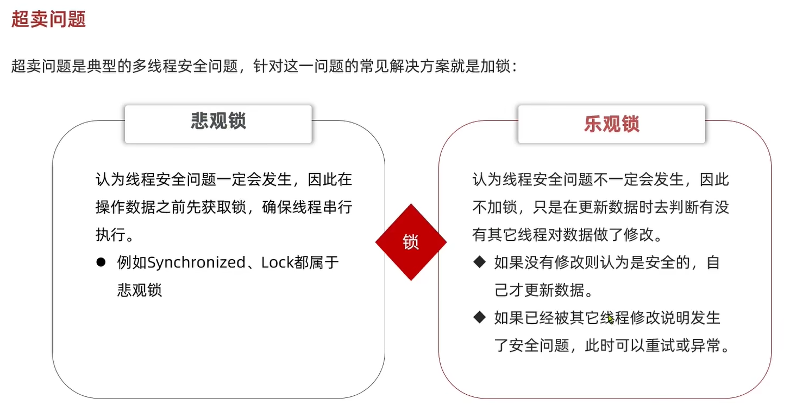

悲观锁效率较低，此处不使用

乐观锁
两种方式


# 一人一单
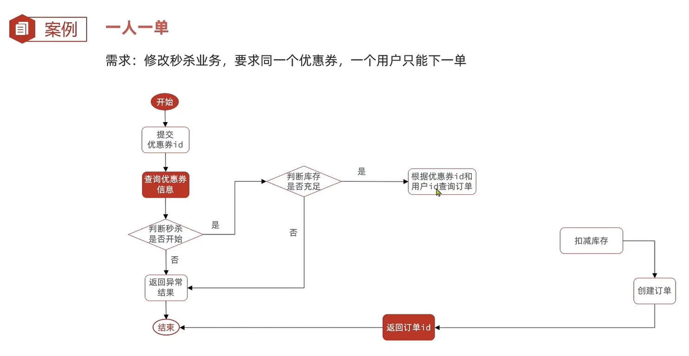

插入优惠券
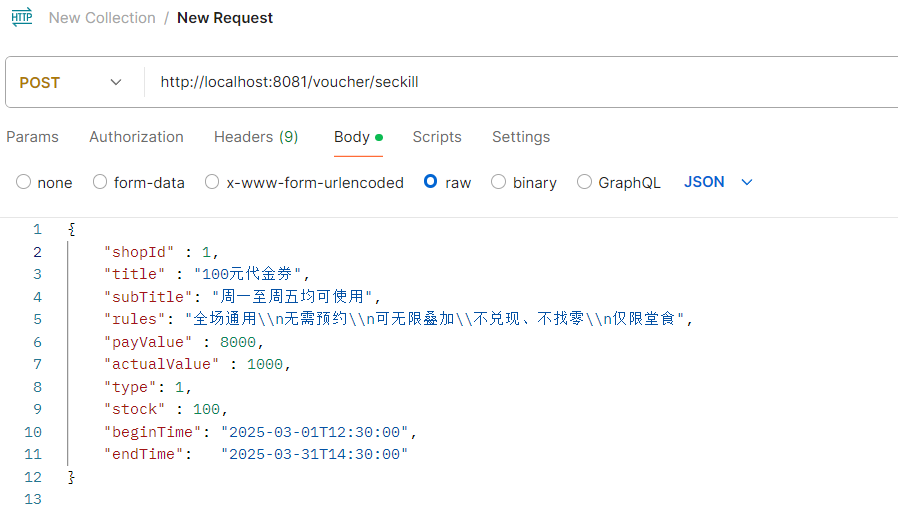
```json
{
    "shopId" : 1,
    "title" : "100元代金券",
    "subTitle": "周一至周五均可使用",
    "rules": "全场通用\\n无需预约\\n可无限叠加\\不兑现、不找零\\n仅限堂食",
    "payValue" : 8000,
    "actualValue" : 1000,
    "type": 1,
    "stock" : 100,
    "beginTime": "2025-03-01T12:30:00",
    "endTime":   "2025-03-31T14:30:00"
}

```

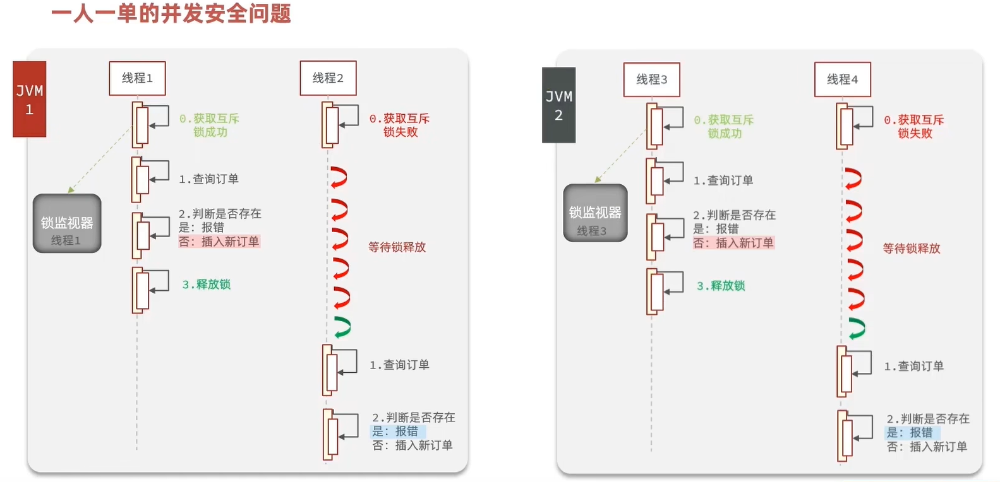

# 分布式锁
解决方法
多个 JVM 使用同一个锁监视器
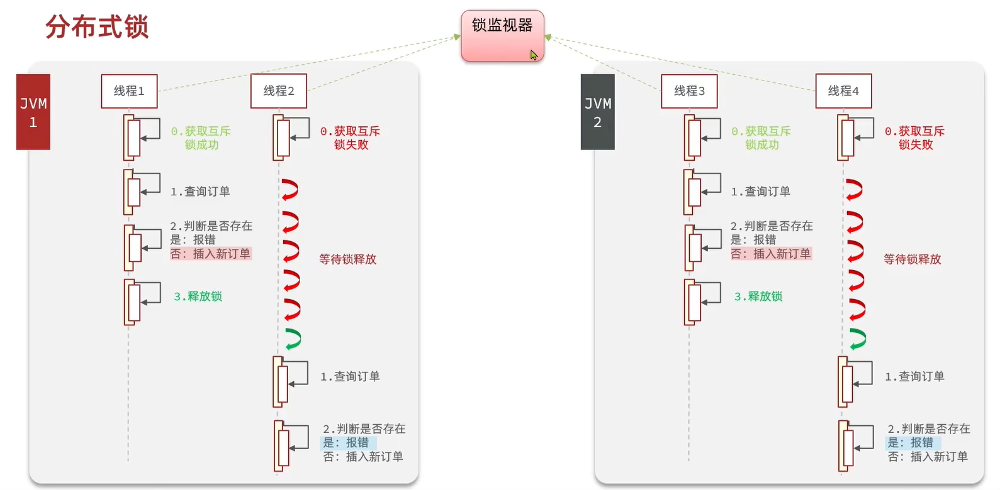
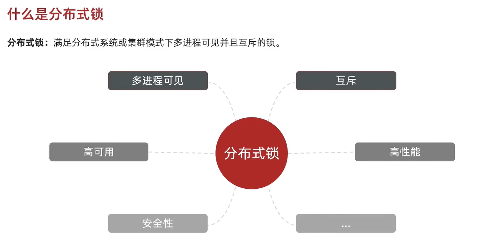

# 分布式锁的实现 对比分析
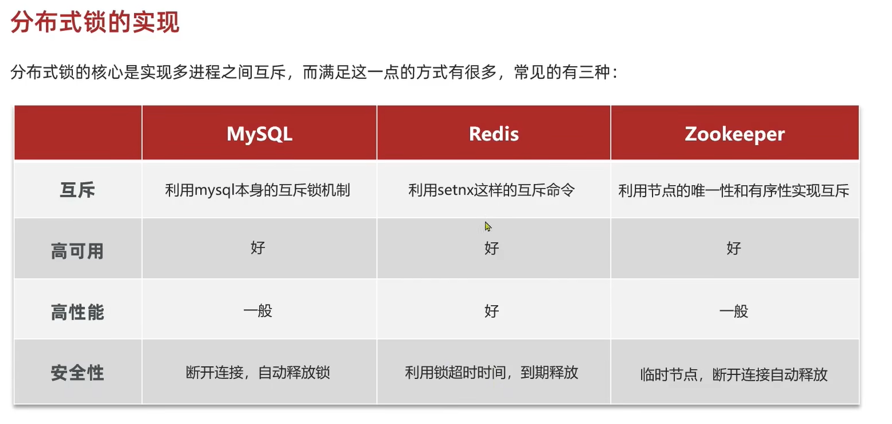


# redis 实现
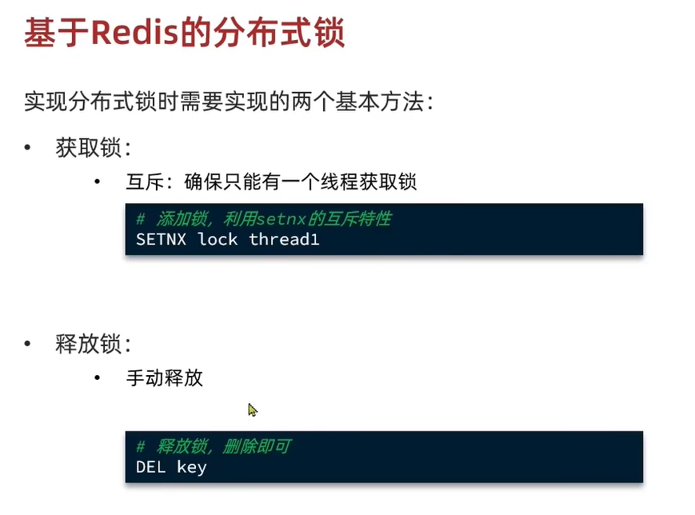

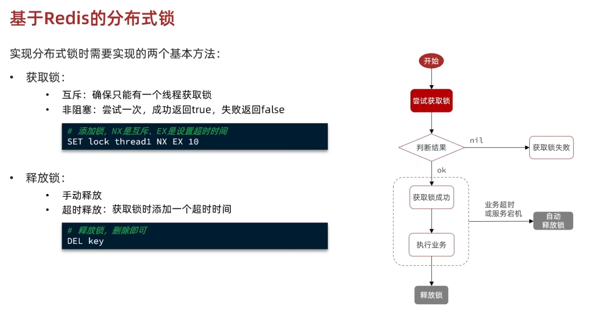

# 基于 Redis 的分布式锁
问题
拿到锁的进程由于各种原因，执行时间过长，以至于 锁的 TTL 超时，则当前进程未执行结束
其他线程就乘虚而入，当其他线程还在执行时，第一个线程完成了，又释放了别人的锁 \
有很大的问题
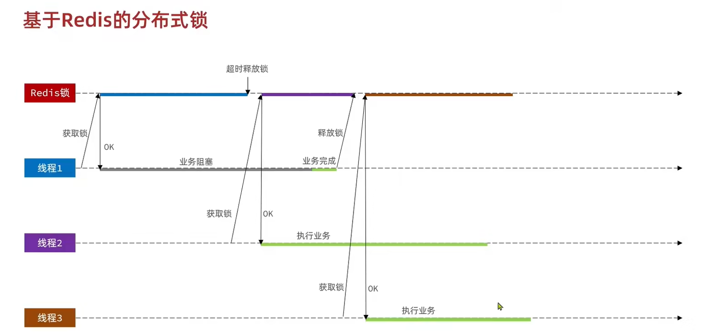

解决方案如下图
在获取锁的时候，存入自己的标识
在释放锁的时候判断是否是自己的锁
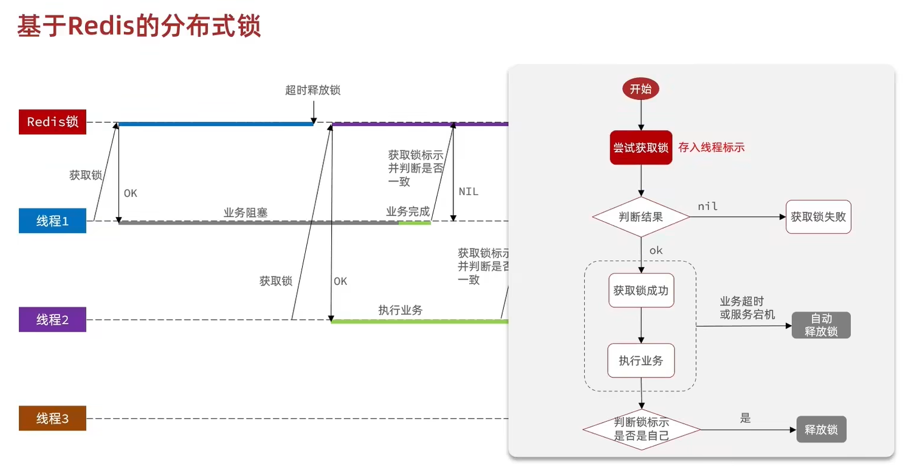


问题
使用UUID可能存在问题，因为两个 JVM 之间的ID 是独立的，可能重复

# 新的问题
解决方法，保证两个动作的原子性\
使用 Lua 脚本
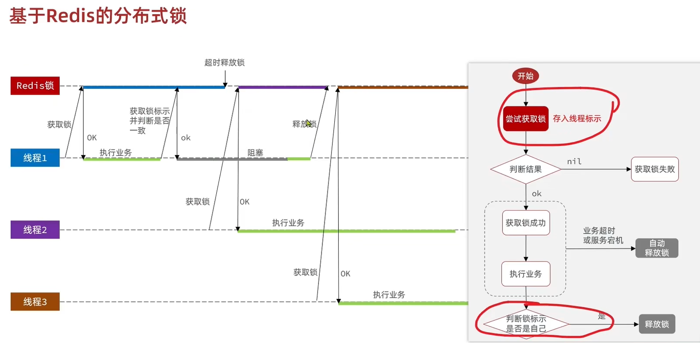

语法
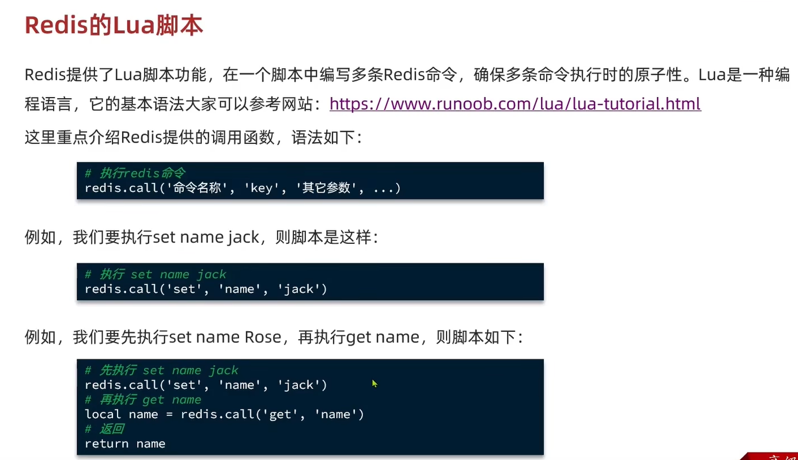

# redisson 功能介绍


入门
- 导入依赖

```json
<dependency>
    <groupId>org.redisson</groupId>
    <artifactId>redisson</artifactId>
    <version>3.13.6</version>
</dependency>
```

- 配置 Redisson 客户端
```java
package com.hmdp.config;

import org.redisson.Redisson;
import org.redisson.api.RedissonClient;
import org.redisson.config.Config;
import org.springframework.context.annotation.Bean;
import org.springframework.context.annotation.Configuration;

@Configuration
public class RedissonConfig {
    @Bean
    public RedissonClient redissonClient(){
        // 配置
        Config config = new Config();
        config.useSingleServer().setAddress("redis://127.0.0.1:6379");

        // 创建 RedissonClient 对象
        return Redisson.create(config);
    }

}

```
更新 voucherOrderServiceImp
```java
@Override
public Result seckillVoucher(Long voucherId) {
    // 1 查询优惠券
    SeckillVoucher voucher = seckillVoucherService.getById(voucherId);
    // 2 判断秒杀是否开始
    if (voucher.getBeginTime().isAfter(LocalDateTime.now())) {
        return Result.fail("秒杀尚未开始");
    }
    // 3 判断秒杀是否已经结束
    if (voucher.getEndTime().isBefore(LocalDateTime.now())) {
        return Result.fail("秒杀已经结束");
    }
    // 4 判断库存是否充足
    if (voucher.getStock() < 1) {
        return Result.fail("库存不足");
    }
    Long userId = UserHolder.getUser().getId();

    // 创建锁对象
    //SimpleRedisLock lock = new SimpleRedisLock("order:" + userId, stringRedisTemplate);
    RLock lock = redissonClient.getLock("lock:order:" + userId);
    // 获取锁
    boolean isLock = lock.tryLock();
    if(!isLock){
        // 获取锁失败 返回错误或者重试
        return Result.fail("不允许重复下单");
    }try {
        // 获取代理对象（事务）
        IVoucherOrderService proxy = (IVoucherOrderService) AopContext.currentProxy();
        return proxy.createVoucherOrder(voucherId);
    }finally {
        // 释放锁
        lock.unlock();
    }

}
```

# Redisson 可重入锁的原理
```redis
SET lock thread1 NX EX 100
```


# 秒杀

把两个阶段抽取出来，分给两个独立的线程去操作
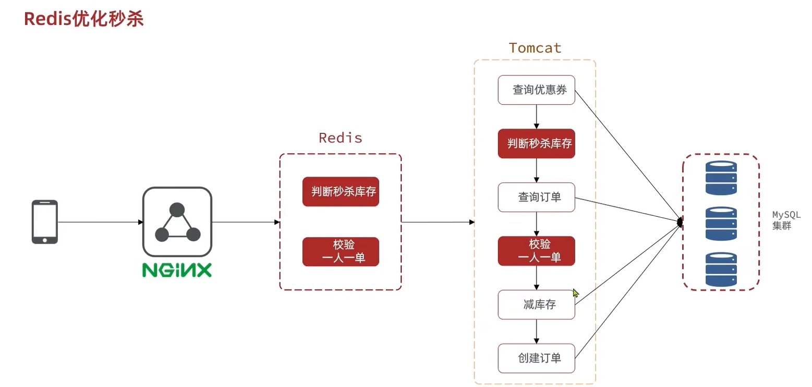

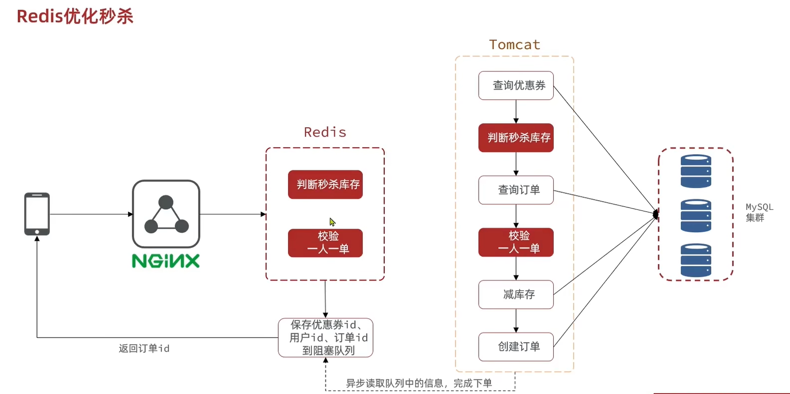

1 首先判断库存是否充足       剩余的优惠券数量 缓存到 redis
2 判断是否一人一单          缓存所有的购买用户到 redis  使用 set 集合 实现

上面两个操作必须保证原子性
使用 Lua 脚本实现原子性

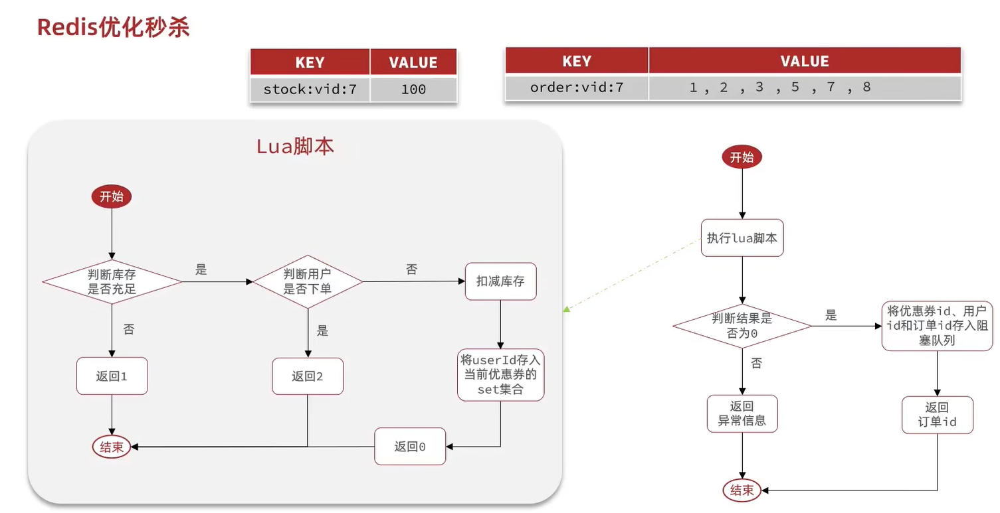

## 需求分析
实现需求一
```java
// 保存秒杀库存到 Redis
stringRedisTemplate.opsForValue().set(SECKILL_STOCK_KEY + voucher.getId(), voucher.getStock().toString());
```
第二步 编写 lua 脚本
```lua
--1 参数列表
--1.1 优惠券id
local voucherId = ARGV[1]
--1.2 用户id
local userID = ARGV[2]


--2 数据key
--2.1 库存key
local stockKey = 'seckill:stock:' .. voucherId
--2.2 订单key
local orderKey = 'seckill:order' .. voucherId

-- 3 脚本业务
-- 3.1 判断库存是否充足
if(tonumber(redis.call('get', stockKey)) <= 0) then
    -- 3.2 库存不足 返回1
    return 1
end


-- 3.2 判断用户是否已经下过单
if(redis.call('sismenber', orderKey, userID) == 1) then
    -- 3.3 存在 说明是重复下单 返回2
    return 2
end

-- 3.4 扣库存 stockKey + (-1)
redis.call('incrby', stockKey, -1)
-- 3.5 下单 保存用户
redis.call('sadd', orderKey, userID)
```


在 redis 上实现了数量和订单缓存
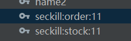

```java
@Override
public Result seckillVoucher(Long voucherId) {
    // 获取用户
    Long userId = UserHolder.getUser().getId();
    // 1 执行 lua 脚本
    Long result = stringRedisTemplate.execute(
            SECKILL_SCRIPT,
            Collections.emptyList(),
            voucherId.toString(), userId.toString()
    );
    // 判断结果是否是 0
    int r = result.intValue();
    if(r != 0){
        // 不是0 代表没有购买资格
        return Result.fail(r == 1 ? "库存不足" : "不能重复下单");
    }
    // 2.2 为 0 有购买资格  把下单信息保存到阻塞队列
    long orderId = redisIdWorker.nextId("order");
    return Result.ok(orderId);
}
```

以上完成了业务 第一第二 阶段

第三阶段 抢单
```java
@Override
public Result seckillVoucher(Long voucherId) {
    // 获取用户
    Long userId = UserHolder.getUser().getId();
    // 1 执行 lua 脚本
    Long result = stringRedisTemplate.execute(
            SECKILL_SCRIPT,
            Collections.emptyList(),
            voucherId.toString(), userId.toString()
    );
    // 判断结果是否是 0
    int r = result.intValue();
    if(r != 0){
        // 不是0 代表没有购买资格
        return Result.fail(r == 1 ? "库存不足" : "不能重复下单");
    }
    // 2.2 为 0 有购买资格  把下单信息保存到阻塞队列
    VoucherOrder voucherOrder = new VoucherOrder();
    // 订单 id
    long orderId = redisIdWorker.nextId("order");
    voucherOrder.setId(orderId);
    // 用户 id
    voucherOrder.setUserId(userId);
    // 代金券id
    voucherOrder.setVoucherId(voucherId);
    // 放入阻塞队列
    orderTask.add(voucherOrder);


    // 返回订单 id
    return Result.ok(orderId);
}
```


秒杀优化基本完成
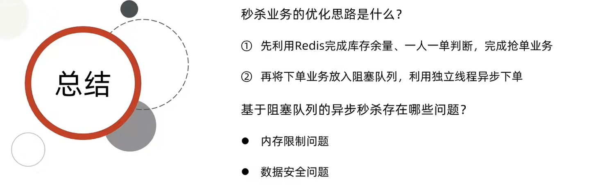
问题 \
使用 JVM 内存
数据安全和不一致的问题

# 1 Redis 基于 List 的消息队列
1 生产者 对 1 消费者
# 2 基于 PubSub 的消息队列  发布订阅模式
1 生产者 对 n 消费者
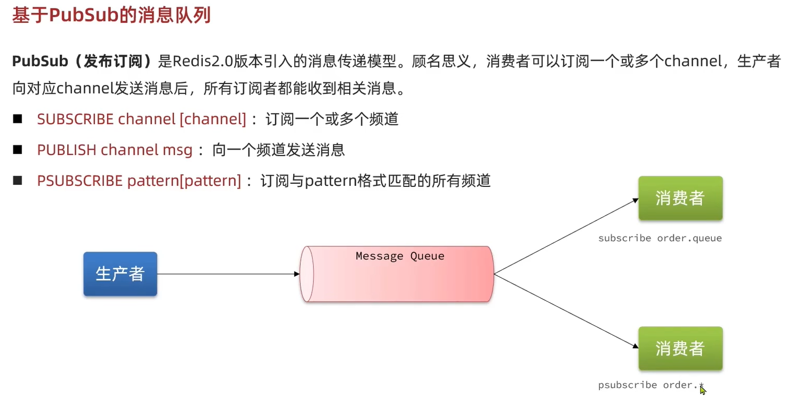


# 3 Redis 基于 Stream 的单消费者模式
```redis
XREAD COUNT 1 BLOCK 1000 STREAMS users $
```

# 4 Redis 基于 Stream 的 消费者组
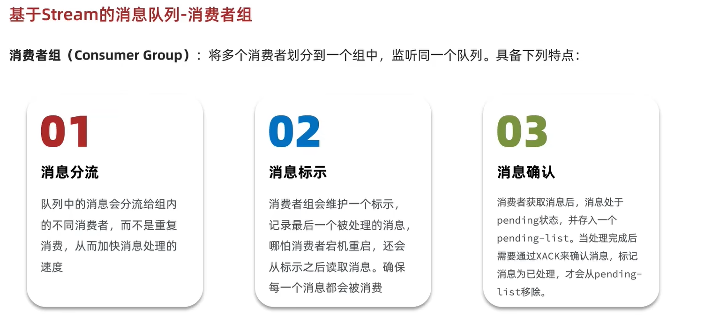
创建消费者组
```redis
XGROUP CREATE 队列名称 消费者组名称 ID [MKSTREAM]
```

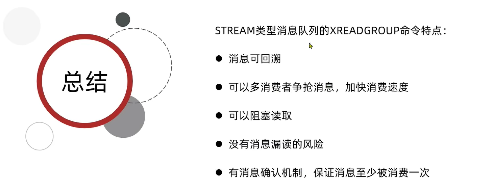


上面四种总结
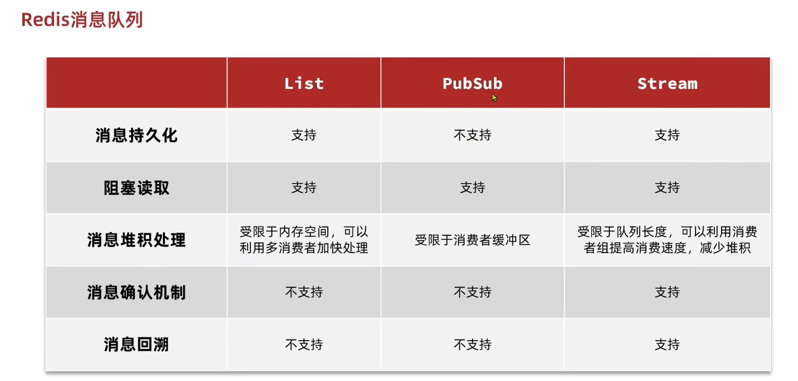


# 实例

基于 Redis 的 Stream 结构作为消息对了 实现异步秒杀下单
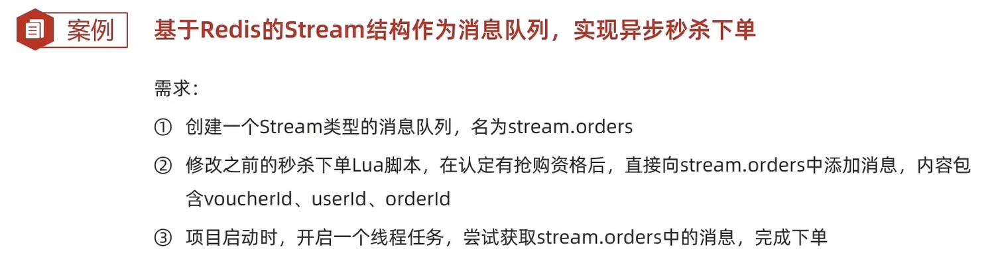


修改 lua 脚本
```lua
--1 参数列表
--1.1 优惠券id
local voucherId = ARGV[1]
--1.2 用户id
local userID = ARGV[2]
--1.3 订单id
local orderID = ARGV[3]


--2 数据key
--2.1 库存key
local stockKey = 'seckill:stock:' .. voucherId
--2.2 订单key
local orderKey = 'seckill:order:' .. voucherId

-- 3 脚本业务
-- 3.1 判断库存是否充足
if(tonumber(redis.call('get', stockKey)) <= 0) then
    -- 3.2 库存不足 返回1
    return 1
end


-- 3.2 判断用户是否已经下过单
if(redis.call('sismember', orderKey, userID) == 1) then
    -- 3.3 存在 说明是重复下单 返回2
    return 2
end

-- 3.4 扣库存 stockKey + (-1)
redis.call('incrby', stockKey, -1)
-- 3.5 下单 保存用户
redis.call('sadd', orderKey, userID)
-- 3.6 发送消息到队列中
redis.call('xadd', 'streams.orders', '*', 'userId', userID, 'voucherId', voucherId, 'id', orderID)
return 0


```

1 改造 方法
```java
@Override
public Result seckillVoucher(Long voucherId) {
    // 获取用户
    Long userId = UserHolder.getUser().getId();
    // 1 执行 lua 脚本
    Long result = stringRedisTemplate.execute(
            SECKILL_SCRIPT,
            Collections.emptyList(),
            voucherId.toString(), userId.toString()
    );
    // 判断结果是否是 0
    int r = result.intValue();
    if(r != 0){
        // 不是0 代表没有购买资格
        return Result.fail(r == 1 ? "库存不足" : "不能重复下单");
    }
    // 2.2 为 0 有购买资格  把下单信息保存到阻塞队列
    VoucherOrder voucherOrder = new VoucherOrder();
    // 订单 id
    long orderId = redisIdWorker.nextId("order");
    voucherOrder.setId(orderId);
    // 用户 id
    voucherOrder.setUserId(userId);
    // 代金券id
    voucherOrder.setVoucherId(voucherId);
    // 放入阻塞队列
    orderTask.add(voucherOrder);

    // 3 获取代理对象
    proxy = (IVoucherOrderService) AopContext.currentProxy();


    // 返回订单 id
    return Result.ok(orderId);
}
```
改为下面的
```java
@Override
public Result seckillVoucher(Long voucherId) {
    // 1 获取用户
    Long userId = UserHolder.getUser().getId();
    // 2 订单 id
    long orderId = redisIdWorker.nextId("order");
    // 3 执行 lua 脚本
    Long result = stringRedisTemplate.execute(
            SECKILL_SCRIPT,
            Collections.emptyList(),
            voucherId.toString(), userId.toString(), String.valueOf(orderId)
    );
    // 2 判断结果是否是 0
    int r = result.intValue();
    if(r != 0){
        // 不是0 代表没有购买资格
        return Result.fail(r == 1 ? "库存不足" : "不能重复下单");
    }
    // 3 获取代理对象
    proxy = (IVoucherOrderService) AopContext.currentProxy();
    // 4 返回订单 id
    return Result.ok(orderId);
}
```


